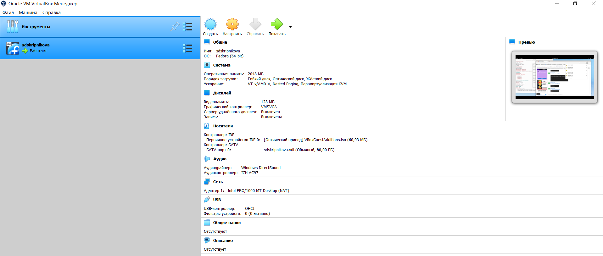
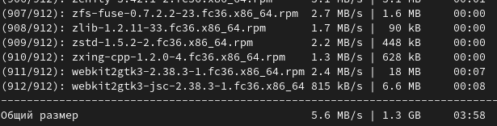
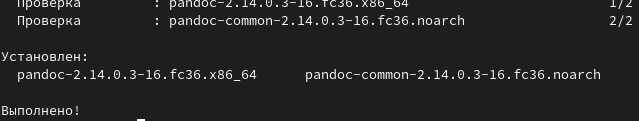
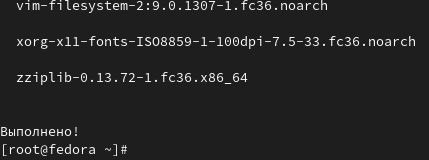
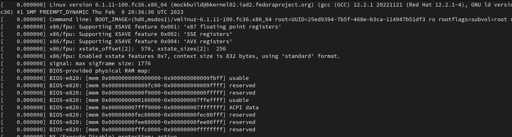
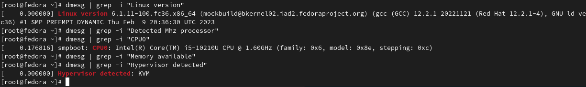

---
## Front matter
lang: ru-RU
title: Защита Лабораторной работы 1
subtitle: презентация
author:
  - Скрипникова С. Д.
institute:
  - Российский университет дружбы народов, Москва, Россия
date: 18 февраля 2023

## i18n babel
babel-lang: russian
babel-otherlangs: english

## Formatting pdf
toc: false
toc-title: Содержание
slide_level: 2
aspectratio: 169
section-titles: true
theme: metropolis
header-includes:
 - \metroset{progressbar=frametitle,sectionpage=progressbar,numbering=fraction}
 - '\makeatletter'
 - '\beamer@ignorenonframefalse'
 - '\makeatother'
---

# Информация

## Докладчик

:::::::::::::: {.columns align=center}
::: {.column width="70%"}

  * Скрипникова София
  * Российский университет дружбы народов
  * [1132226523@pfur.ru](1132226523@pfur.ru)
 

:::
::: {.column width="30%"}

:::
::::::::::::::

# Вводная часть

## Цель

- Научиться устанавливать виртуальную машину

## 1 этап

- Виртуальная машина у меня уже установлена и исправно работает

## 2 этап 

- Установка обновлений 

## 3 этап

- Установка  `pandoc` 

## 4 этап

- Установка texlive

## Выполнение домашнего задания

:::

