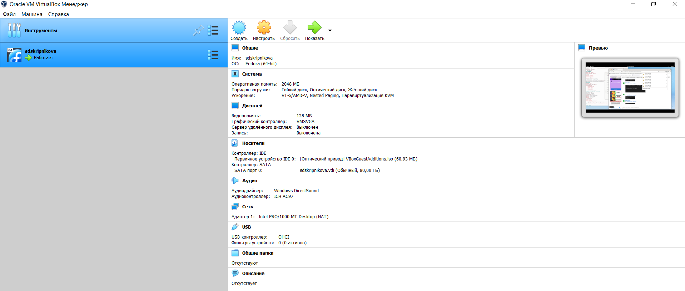
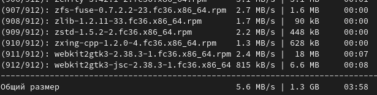
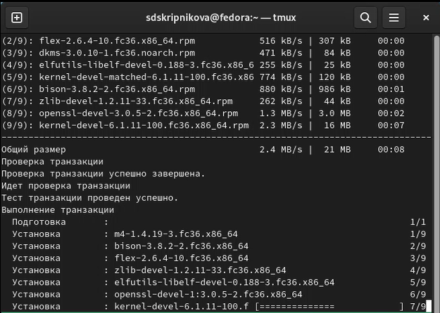
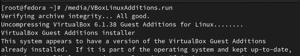
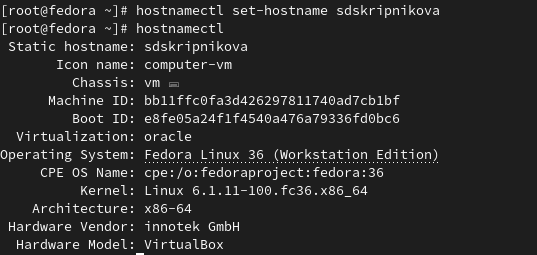
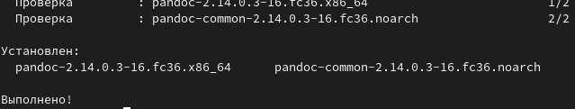
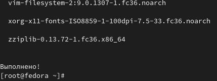
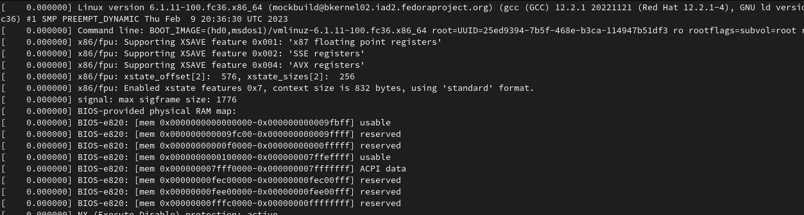
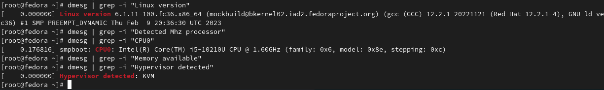

---
## Front matter
title: "Шаблон отчёта по лабораторной работе"
subtitle: "Отчет по лабораторной работе 1"
author: "Скрипникова София Дмитриевна"

## Generic otions
lang: ru-RU
toc-title: "Содержание"

## Bibliography
bibliography: bib/cite.bib
csl: pandoc/csl/gost-r-7-0-5-2008-numeric.csl

## Pdf output format
toc: true # Table of contents
toc-depth: 2
lof: true # List of figures
lot: true # List of tables
fontsize: 12pt
linestretch: 1.5
papersize: a4
documentclass: scrreprt
## I18n polyglossia
polyglossia-lang:
  name: russian
  options:
	- spelling=modern
	- babelshorthands=true
polyglossia-otherlangs:
  name: english
## I18n babel
babel-lang: russian
babel-otherlangs: english
## Fonts
mainfont: PT Serif
romanfont: PT Serif
sansfont: PT Sans
monofont: PT Mono
mainfontoptions: Ligatures=TeX
romanfontoptions: Ligatures=TeX
sansfontoptions: Ligatures=TeX,Scale=MatchLowercase
monofontoptions: Scale=MatchLowercase,Scale=0.9
## Biblatex
biblatex: true
biblio-style: "gost-numeric"
biblatexoptions:
  - parentracker=true
  - backend=biber
  - hyperref=auto
  - language=auto
  - autolang=other*
  - citestyle=gost-numeric
## Pandoc-crossref LaTeX customization
figureTitle: "Рис."
tableTitle: "Таблица"
listingTitle: "Листинг"
lofTitle: "Список иллюстраций"
lotTitle: "Список таблиц"
lolTitle: "Листинги"
## Misc options
indent: true
header-includes:
  - \usepackage{indentfirst}
  - \usepackage{float} # keep figures where there are in the text
  - \floatplacement{figure}{H} # keep figures where there are in the text
---

# Цель работы

Целью данной работы является приобретение практических навыков установки операционной системы на виртуальную машину, настройки минимально необходимых для дальнейшей работы сервисов.

# Задание
Настроить работу виртуальной машины 

# Теоретическое введение

Здесь описываются теоретические аспекты, связанные с выполнением работы.

Например, в табл. @tbl:std-dir приведено краткое описание стандартных каталогов Unix.

: Описание некоторых каталогов файловой системы GNU Linux {#tbl:std-dir}

| Имя каталога | Описание каталога                                                                                                          |
|--------------|----------------------------------------------------------------------------------------------------------------------------|
| `/`          | Корневая директория, содержащая всю файловую                                                                               |
| `/bin `      | Основные системные утилиты, необходимые как в однопользовательском режиме, так и при обычной работе всем пользователям     |
| `/etc`       | Общесистемные конфигурационные файлы и файлы конфигурации установленных программ                                           |
| `/home`      | Содержит домашние директории пользователей, которые, в свою очередь, содержат персональные настройки и данные пользователя |
| `/media`     | Точки монтирования для сменных носителей                                                                                   |
| `/root`      | Домашняя директория пользователя  `root`                                                                                   |
| `/tmp`       | Временные файлы                                                                                                            |
| `/usr`       | Вторичная иерархия для данных пользователя                                                                                 |

Более подробно об Unix см. в [@gnu-doc:bash;@newham:2005:bash;@zarrelli:2017:bash;@robbins:2013:bash;@tannenbaum:arch-pc:ru;@tannenbaum:modern-os:ru].

# Выполнение лабораторной работы

В 1 семестре мы уже выполняли уствновку виртуальной машины, на фото представлена ее настройка, все данные введены корректно. В конце будет представлена ссылка на репозиторий,где можно найти отчет по установки(рис. @fig:001).

{#fig:001 width=70%}

Т.к моя виртуальная машина уже  установлена, мне нужно скачать на нее обновления, захожу в терминал, как супер-пользователь (рис. @fig:002)

{#fig:002 width=70%}

Обновляю все пакеты (рис. @fig:003)

{#fig:003 width=70%}

Установка программ для удобства работы в консоли (рис. @fig:004)

{#fig:004 width=70%}

Установка программного обеспечения для автоматического обновление и установка таймера (рис. @fig:005)

{#fig:005 width=70%}

Установка пакетов Dkms (рис. @fig:006)

{#fig:006 width=70%}

Установка драйвера (рис. @fig:007)

{#fig:007 width=70%}

Установка имени хоста (рис. @fig:008)

{#fig:008 width=70%}

Установка pandoc (рис. @fig:009)

{#fig:009 width=70%}

Установка texlive (рис. @fig:010)

{#fig:010 width=70%}

# Домашняя работа

Команда dmesg (рис. @fig:011)

{#fig:011 width=70%}

Поиск с помощью grep (рис. @fig:012)

{#fig:012 width=70%}

# Контрольные вопросы 
1) Какую информацию содержит учётная запись пользователя? Имя пользова-
теля (user name)
Индентификационный номер пользвателя (UID)
Индентификационный номер группы (GID)
Пароль (password)
Полное имя (full name)
Домашний каталог (home directory)
Начальную оболочку (login shell)
2) Укажите команды терминала и приведите примеры:
для получения справки по команде –help
для перемещения по файловой системе -cd
для просмотра содержимого каталога -ls
для определения объёма каталога du
для создания / удаления каталогов / файлов - mkdir -создание, rm -r - удаление
для задания определённых прав на файл / каталог - touch/rm
для просмотра истории команд -history
3) Что такое файловая система? Приведите примеры с краткой характеристи-
кой.
Файловая система - порядок, определяющий способ организации,хранения и
наименования данных на носителях иации в пк, а также в другом электронном оборудовании: цифровых фотоаппаратах, мобильных телефона и тд. Файловая
система определяет формат содержимого и способ физического хранения ин-
формации, которую пинято группировать в виде файлов. Конкретная файло-
вая система и раздел, набор атрибутов файла. Некоторые файловые системы
представляют сервисные возможности, например, разграничение доступа или
цифрование файлов.
4)Как посмотреть, какие файловые системы подмонтированы в ОС?
Df - утилита, показывающая список всех файловых систем по имени устройства,
сообщает их размер, занятое и свободное пространство и точки монтирования.
При выполнении бещ аргумента, команда mount выведет все подключенные
данные.
5)Как удалить зависший процесс?
С помощью команды killall-killall ().

# Выводы

Приобрела навыки по установке виртуальной машины

# Список литературы{.unnumbered}

::: {#refs}
:::
