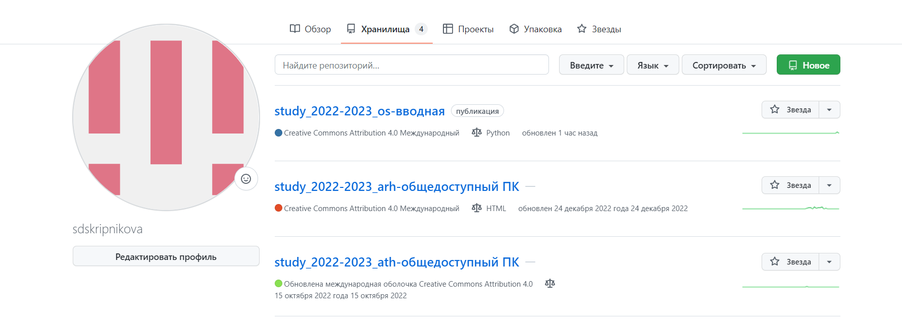
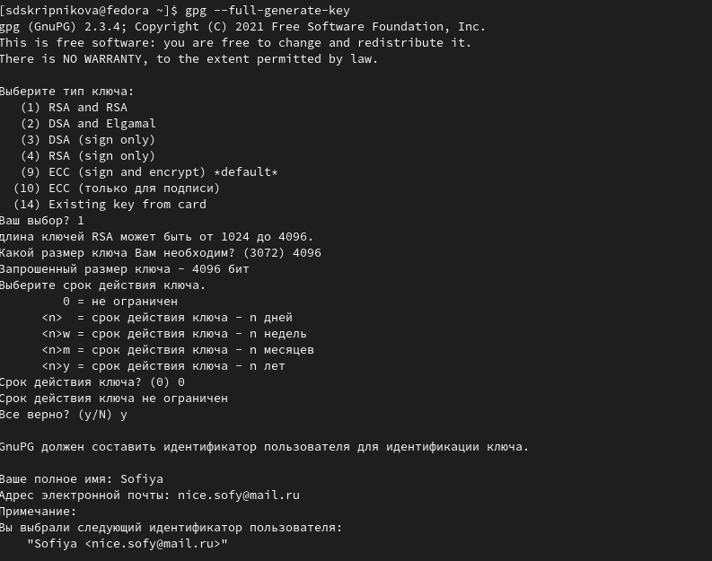
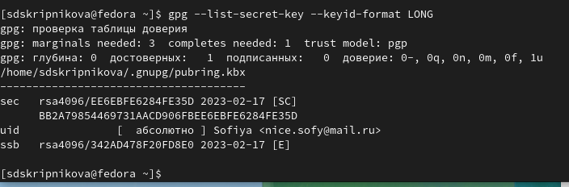
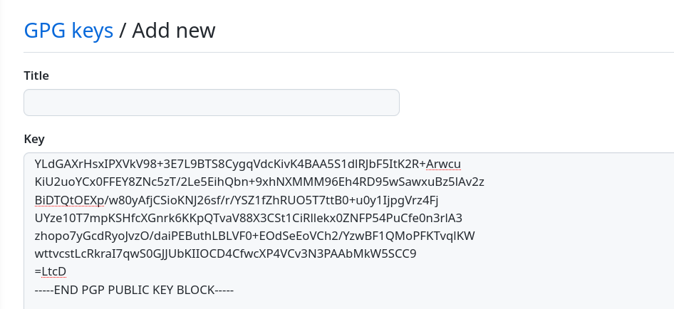
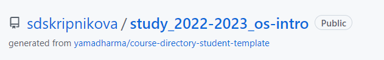
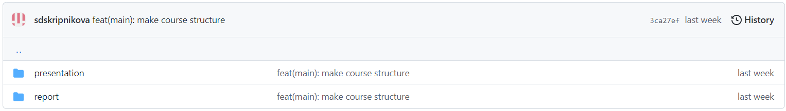

---
## Front matter
title: "Лабораторная работа 2"
author: "Скрипникова София "

## Generic otions
lang: ru-RU
toc-title: "Содержание"

## Bibliography
bibliography: bib/cite.bib
csl: pandoc/csl/gost-r-7-0-5-2008-numeric.csl

## Pdf output format
toc: true # Table of contents
toc-depth: 2
lof: true # List of figures
lot: true # List of tables
fontsize: 12pt
linestretch: 1.5
papersize: a4
documentclass: scrreprt
## I18n polyglossia
polyglossia-lang:
  name: russian
  options:
	- spelling=modern
	- babelshorthands=true
polyglossia-otherlangs:
  name: english
## I18n babel
babel-lang: russian
babel-otherlangs: english
## Fonts
mainfont: PT Serif
romanfont: PT Serif
sansfont: PT Sans
monofont: PT Mono
mainfontoptions: Ligatures=TeX
romanfontoptions: Ligatures=TeX
sansfontoptions: Ligatures=TeX,Scale=MatchLowercase
monofontoptions: Scale=MatchLowercase,Scale=0.9
## Biblatex
biblatex: true
biblio-style: "gost-numeric"
biblatexoptions:
  - parentracker=true
  - backend=biber
  - hyperref=auto
  - language=auto
  - autolang=other*
  - citestyle=gost-numeric
## Pandoc-crossref LaTeX customization
figureTitle: "Рис."
tableTitle: "Таблица"
listingTitle: "Листинг"
lofTitle: "Список иллюстраций"
lotTitle: "Список таблиц"
lolTitle: "Листинги"
## Misc options
indent: true
header-includes:
  - \usepackage{indentfirst}
  - \usepackage{float} # keep figures where there are in the text
  - \floatplacement{figure}{H} # keep figures where there are in the text
---

# Цель работы

Изучить идеологию и применение средств контроля версий. Освоить умения по работе с git.

# Выполнение лабораторной работы

 В прошлом семестре мною была выполнена привязка git, все функционирует исправно (рис. @fig:001).

{#fig:001 width=70%}

 Генерирование ключей PGP и их настройка (рис. @fig:002).

 {#fig:002 width=70%}

 Далее выводим список ключей (рис. @fig:003).

 {#fig:003 width=70%}

 Копируем наш сгенерированный PGP ключ в буфер обмена (рис. @fig:004).

 {#fig:004 width=70%}

 Переходим в настройки GitHub и вставляем полученный ключ в поле ввода (рис. @fig:005).

 {#fig:005 width=70%}

 Настройка автоматических подписей (рис. @fig:006).

 {#fig:005 width=70%}

 Далее вручную я создала репозиторий по шаблону (рис. @fig:007); (рис. @fig:008).

 {#fig:007 width=70%}

 {#fig:008 width=70%}

#Контрольные вопросы

1) Система контроля версий (Version Control System, VCS) − программное
обеспечение для облегчения работы с изменяющейся информацией.
VCS позволяет хранить несколько версий одного и того же документа,
при необходимости возвращаться к более ранним версиям, определять,
кто и когда сделал то или иное изменение, и многое другое.
Системы контроля версий (Version Control System, VCS) применяются
при работе нескольких человек над одним проектом. Обычно основное
дерево проекта хранится в локальном или удалённом репозитории, к
которому настроен доступ для участников проекта. При внесении
изменений в содержание проекта система контроля версий позволяет их
фиксировать, совмещать изменения, произведённые разными
участниками проекта, производить откат к любой более ранней версии
проекта, если это требуется.
Сервер может сохранять не полную версию изменённых файлов, а
производить так называемую дельта-компрессию − сохранять только изменения между последовательными версиями, что позволяет
уменьшить объём хранимых данных.
Системы контроля версий поддерживают возможность отслеживания и
разрешения конфликтов, которые могут возникнуть при работе
нескольких человек над одним файлом. Можно объединить (слить)
изменения, сделанные разными участниками (автоматически или
вручную), вручную выбрать нужную версию, отменить изменения вовсе
или заблокировать файлы для изменения. В зависимости от настроек
блокировка не позволяет другим пользователям получить рабочую
копию или препятствует изменению рабочей копии файла средствами
файловой системы ОС, обеспечивая таким образом,
привилегированный доступ только одному пользователю, работающему
с файлом.
2) Хранилище (репозиторий) − в нем хранятся все документы вместе с
историей их изменения и другой служебной информацией.
Рабочую копию необходимо периодически синхронизировать с
репозиторием, эта операция предполагает отправку в него изменений,
которые пользователь внес в свою рабочую копию. За это отвечает
команда commit. С помощью этой команды можно также передать
комментарий о сделанных изменениях.
История – список предыдущих изменений/коммитов.
Рабочая копия – копия проекта, связанная с репозиторием, в которой
непосредственно работает пользователь.
3) Централизованные VCS
Клиент-серверная модель: один центральный репозиторий, с которым
разработчики взаимодействуют по сети. Примеры:
 CVS
 Subversion (SVN)
 Perforce
Децентрализованная VCS
Клиенты полностью копируют репозиторий, вместо простого
скачивания снимка всех файлов (состояния файлов в определенный
момент времени). В этом случае, если сервер выйдет из строя, то
клиентский репозиторий можно будет скопировать на другой, рабочий,
сервер, ведь данный репозиторий является полным бэкапом всех данных.Примеры:
 Git
 Mercurial
 Bazaar
4) Действия с VCS при единоличной работе с хранилищем:
 Создать новый репозиторий на локальном устройстве (если он не
был создан),
 Внести изменения в исходные файлы,
 Выполнить индексацию необходимых файлов,
 Проверить внесенные изменения,
 Выполнить commit,
 Отправить локальный репозиторий на удаленный сервер, при
необходимости.
5) Действия при работе с общим хранилищем VCS:
 Обычно проект уже создан и его нужно загрузить из общего
удаленного хранилища,
 Необходимо создать свою рабочую ветку,
 Внести изменения внутри своей рабочей ветки,
 Выполнить индексацию необходимых файлов на своем локальном
устройстве,
 Проверить внесенные изменения,
 Выполнить commit,
 Свою рабочую ветку отправить в общее хранилище,
 При необходимости внести изменения и отправить снова,
 После администратор объединит вашу ветку с master branch.
6) Git − это система управления версиями. У Git две основных задачи:
первая − хранить информацию о всех изменениях в вашем коде,
начиная с самой первой строчки, а вторая − обеспечение удобства
командной работы над кодом.
Git запоминает не все изменения, а только те, которые вы скажите.
Обычно работа с Git выглядит так:
 сверстали шапку сайта − сделали commit;
 сверстали контент страницы − сделали второй commit;
 закончили верстать страницу − сделали третий commit и
отправили код на сервер, чтобы вашу работу могли увидеть
коллеги, либо чтобы опубликовать страницу с помощью
Capistrano.
7) Наиболее часто используемые команды git:
 создание основного дерева репозитория:
git init
 получение обновлений (изменений) текущего дерева из
центрального репозитория:
git pull
 отправка всех произведённых изменений локального дерева в
центральный репозиторий:
git push
 просмотр списка изменённых файлов в текущей директории:
git status
 просмотр текущих изменения:
git diff
 сохранение текущих изменений:
o добавить все изменённые и/или созданные файлы и/или
каталоги:
git add .
o добавить конкретные изменённые и/или созданные файлы
и/или каталоги:
git add имена_файлов
o удалить файл и/или каталог из индекса репозитория (при
этом файл и/или каталог остаётся в локальной директории):
git rm имена_файлов
 сохранение добавленных изменений:
o сохранить все добавленные изменения и все изменённые
файлы:
git commit -am 'Описание коммита'
o сохранить добавленные изменения с внесением
комментария через встроенный редактор:
git commit
 создание новой ветки, базирующейся на текущей:
git checkout -b имя_ветки
 переключение на некоторую ветку:
git checkout имя_ветки (при переключении на ветку, которой ещё
нет в локальном репозитории, она будет создана и связана с
удалённой)
 отправка изменений конкретной ветки в центральный
репозиторий:
git push origin имя_ветки
 слияние ветки с текущим деревом:
git merge --no-ff имя_ветки
 удаление ветки:
o удаление локальной уже слитой с основным деревом ветки:
git branch -d имя_ветки
o принудительное удаление локальной ветки:
git branch -D имя_ветки
o удаление ветки с центрального репозитория:
git push origin :имя_ветки
8) Примеры использования VCS при работе с локальными репозиториями:
Создание небольшого проекта на своем локальном устройстве, работа с
файлами (например, каталог, содержащий документы, презентации,
которые будут часто редактироваться), работа с фотографиями, видео и
т.д.
Примеры использования VCS при работе с удаленными репозиториями:
Примеры могут быть те же, но теперь над ними работают несколько
человек. Такая система позволяет следить за работой других
пользователей.
9) Ветвление («ветка», branch) − один из параллельных участков истории
в одном хранилище, исходящих из одной версии (точки ветвления).
 Обычно есть главная ветка (master), или ствол (trunk).
 Между ветками, то есть их концами, возможно слияние.
Ветки используются для разработки одной части функционала
изолированно от других. Каждая ветка представляет собой отдельную
копию кода проекта. Ветки позволяют одновременно работать над
разными версиями проекта.
Каждый репозиторий по-умолчанию имеет ветку master. Всякий раз,
когда требуется разработка нового функционала, не внося при этом
изменений в основную рабочую версию, можно создавать новую ветку,
на основе рабочей, и вести разработку в ней − новой копии кода проекта.
Когда функционал доделан и оттестирован, можно сделать merge − слить отдельную ветку обратно с основной. При слиянии этой
временной ветки в основную, все её коммиты разом перенесутся из
одной в другую.
Ветвление позволяет обеспечить процесс, при котором всегда в наличии
будет рабочая версия проекта, в которой не будет частично
завершённого функционала находящегося в активной разработке или же
непротестированных фич.
10) Во время работы над проектом так или иначе могут создаваться
файлы, которые не требуется добавлять в последствии в репозиторий.
Например, временные файлы, создаваемые редакторами, или объектные
файлы, создаваемые компиляторами. Можно прописать шаблоны
игнорируемых при добавлении в репозиторий типов файлов в
файл .gitignore с помощью сервисов. Для этого сначала нужно получить
список имеющихся шаблонов:
curl -L -s https://www.gitignore.io/api/list
Затем скачать шаблон, например, для C и C++

# Выводы
Я освоила изучила идеологию и применение средств контроля версий

# Список литературы{.unnumbered}

::: {#refs}
:::
