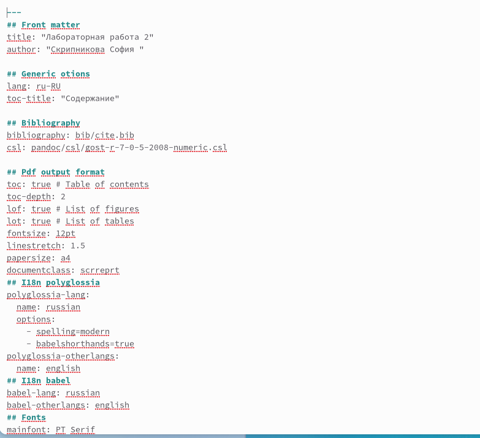
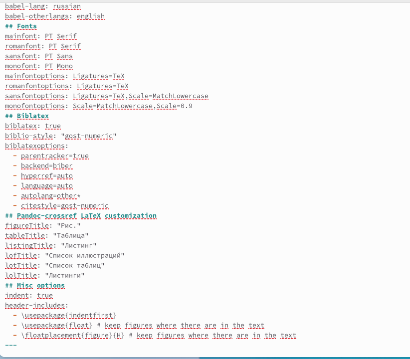
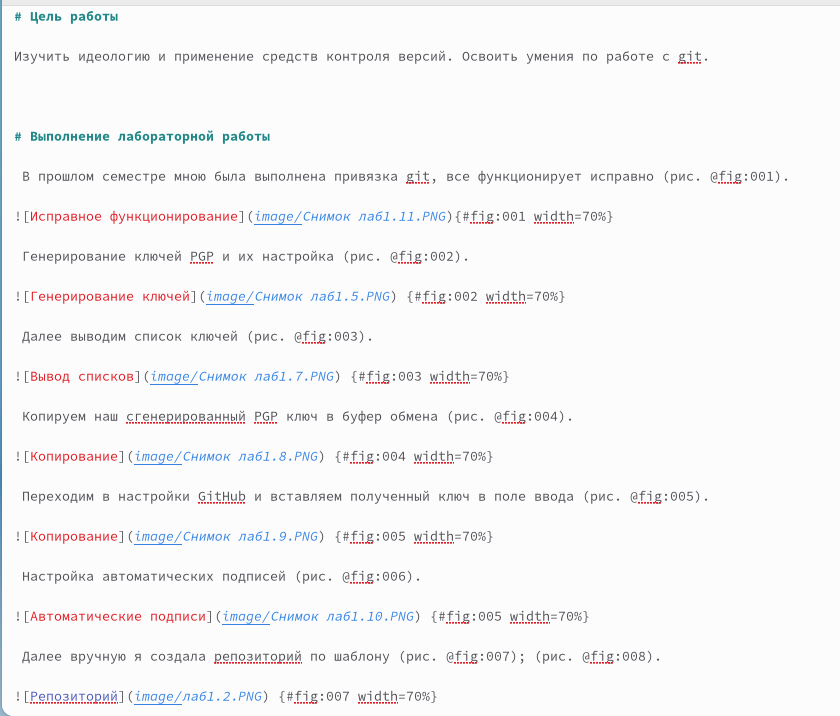
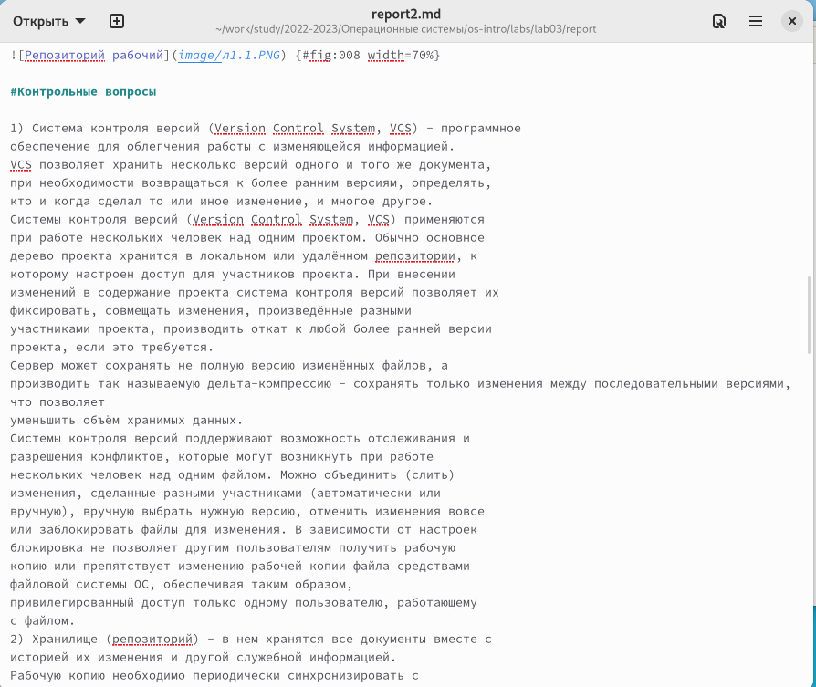
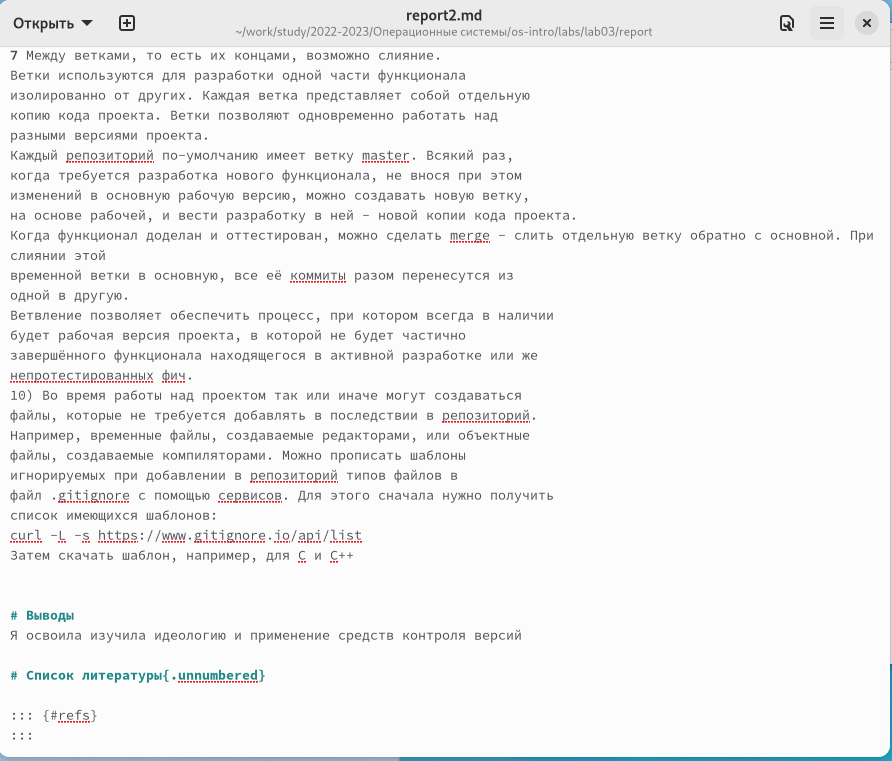

---
## Front matter
lang: ru-RU
title: Выполнение лабораторной работы 3
author:
  - Скрипникова С. Д.
institute:
  - Российский университет дружбы народов, Москва, Россия
date: 21 февраля 2023

## i18n babel
babel-lang: russian
babel-otherlangs: english

## Formatting pdf
toc: false
toc-title: Содержание
slide_level: 2
aspectratio: 169
section-titles: true
theme: metropolis
header-includes:
 - \metroset{progressbar=frametitle,sectionpage=progressbar,numbering=fraction}
 - '\makeatletter'
 - '\beamer@ignorenonframefalse'
 - '\makeatother'
---

# Информация

## Докладчик

:::::::::::::: {.columns align=center}
::: {.column width="70%"}

  * Скрипникова София Дмитриевна
  * Российский университет дружбы народов
  * [1132226523@pfur.ru](mailto:1132226523@pfur.ru)

:::
::: {.column width="30%"}

:::
::::::::::::::

# Этапы работы

## 1 этап

## 2 этап

## 3 этап

## 4 этап

## 5 этап

## Вывод

- Я научилась делать отчеты в формате Markdown

