---
## Front matter
lang: ru-RU
title: Защита лабораторной работе №5
subtitle: Операционные системы
author:
  - Скрипникова София Дмитриевна, НММбд-03-22
institute:
  - Российский университет дружбы народов, Москва, Россия
date: 11 марта 2023

## i18n babel
babel-lang: russian
babel-otherlangs: english

## Formatting pdf
toc: false
toc-title: Содержание
slide_level: 2
aspectratio: 169
section-titles: true
theme: metropolis
header-includes:
 - \metroset{progressbar=frametitle,sectionpage=progressbar,numbering=fraction}
 - '\makeatletter'
 - '\beamer@ignorenonframefalse'
 - '\makeatother'
---

# Информация

## Докладчик

:::::::::::::: {.columns align=center}
::: {.column width="70%"}

  * Cкрипникова София Дмитриевна
  * студентка направления "Математика и механика"
  * Российский университет дружбы народов
  * [1132226523@pfur.ru](1132226523@mail.ru)

:::
::: {.column width="30%"}

:::
::::::::::::::

# Вводная часть

## Цель работы

Ознакомление с файловой системой Linux, её структурой, именами и содержанием каталогов. Приобретение практических навыков по применению команд для работы с файлами и каталогами, по управлению процессами (и работами), по проверке использования диска и обслуживанию файловой системы.

# Основная часть

## Выполнение лабораторной работы

- Выполнила все примеры, приведённые в первой части описания лабораторной работы

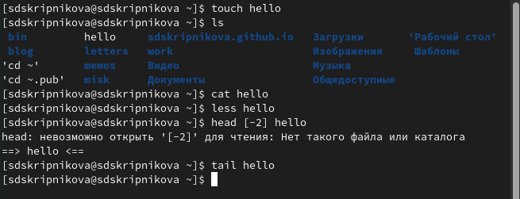{#fig:001 width=40%}

## Этап 2

- Скопировала файл /usr/include/sys/io.h в домашний каталог и назовите его equipment.

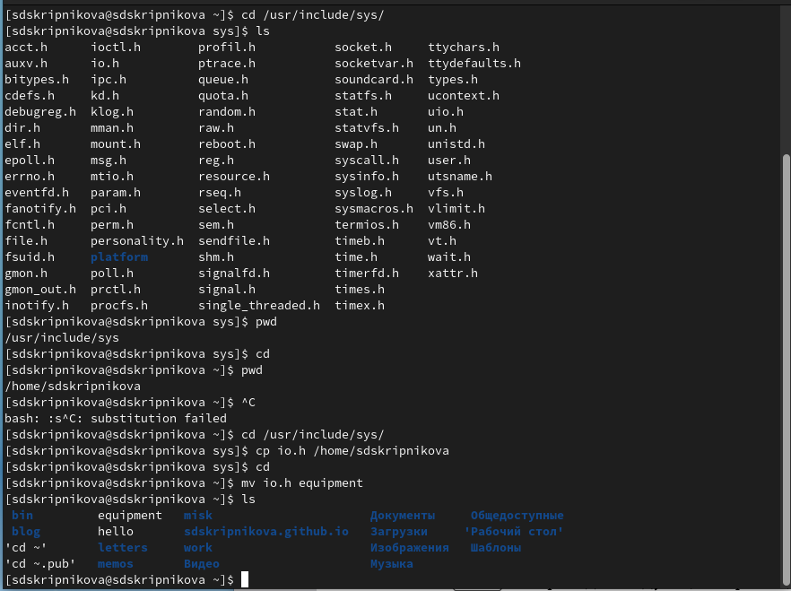{#fig:002 width=40%}

## Этап 2

- В домашнем каталоге создала директорию ~/ski.plases.

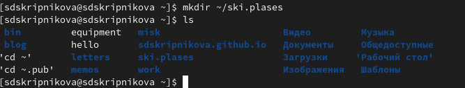{#fig:003 width=40%}

- Переместила файл equipment в каталог ~/ski.plases.

{#fig:004 width=40%}

## Этап 2

- Переименовала файл ~/ski.plases/equipment в ~/ski.plases/equiplist.

{#fig:005 width=40%}

- Создала в домашнем каталоге файл abc1 и скопировала его в каталог ~/ski.plases, назвала его equiplist2.

{#fig:006 width=40%}

## Этап 2

- Создаем каталог с именем equipment в каталоге ~/ski.plases.

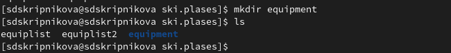{#fig:007 width=40%}

- Переместила файлы ~/ski.plases/equiplist и equiplist2 в каталог ~/ski.plases/equipment.

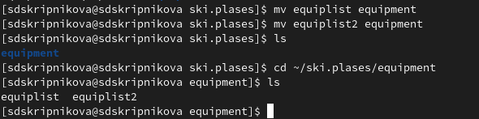{#fig:008 width=40%}

## Этап 2

- Создала и переместила каталог ~/newdir в каталог ~/ski.plases и назвала его plans.

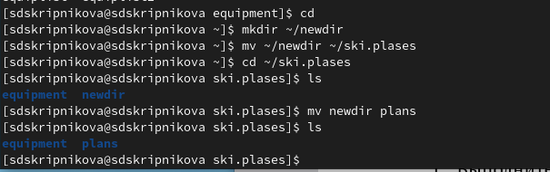{#fig:009 width=40%}

## Этап 3

- Определите опции команды chmod, необходимые для того, чтобы присвоить перечисленным ниже файлам выделенные права доступа.

- С помощью команды chmod файлу australia присвоила нужные права доступа.

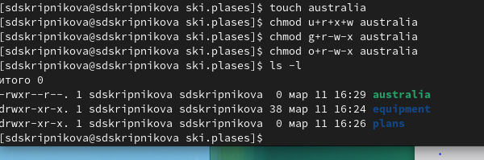{#fig:010 width=40%}

## Этап 3

- С помощью команды chmod файлу play присвоила нужные права доступа.

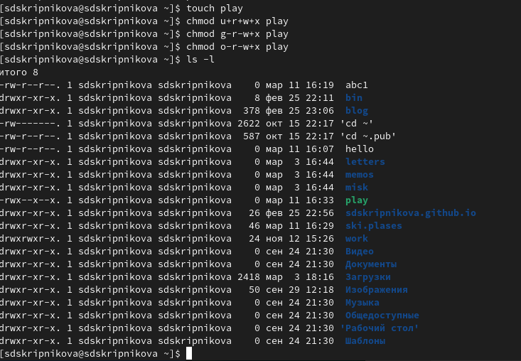{#fig:011 width=40%}

## Этап 3

- С помощью команды chmod файлу my_os присвоила нужные права доступа.

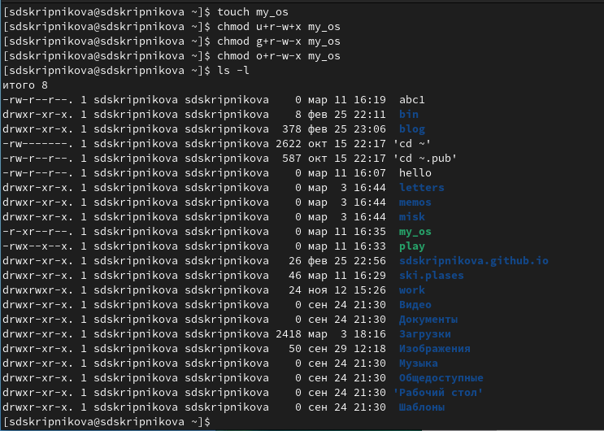{#fig:012 width=40%}

## Этап 3

- С помощью команды chmod файлу feathers присвоила нужные права доступа.

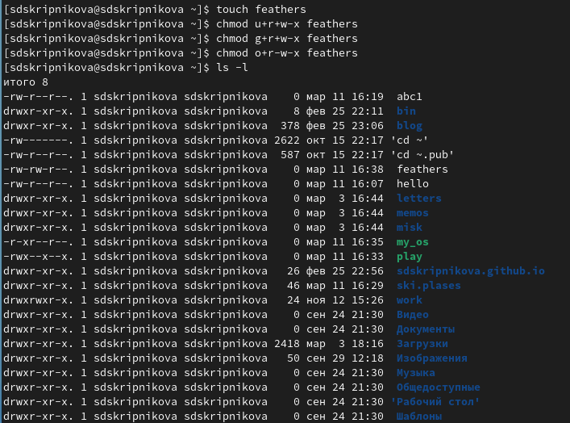{#fig:013 width=40%}

## Этап 4

- Просмотрела содержимое файла /etc/password.

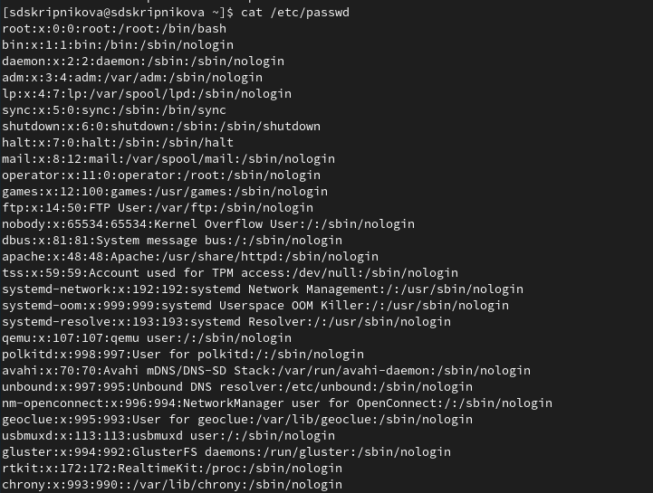{#fig:014 width=40%}

## Этап 4

- Скопировала файл ~/feathers в файл ~/file.old.

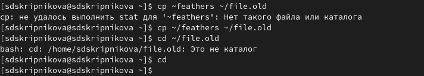{#fig:015 width=40%}

- Переместила файл ~/file.old в каталог ~/play.

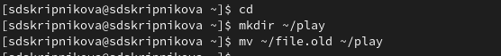{#fig:016 width=40%}

- Скопировала каталог ~/play в каталог ~/fun.

{#fig:017 width=40%}

## Этап 4

- Переместила каталог ~/fun в каталог ~/play и назвала его games.

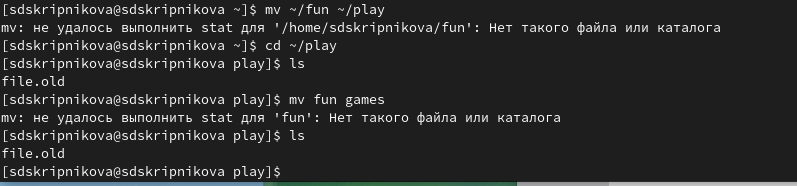{#fig:018 width=40%}

## Этап 4

- Лишила владельца файла ~/feathers права на чтение.

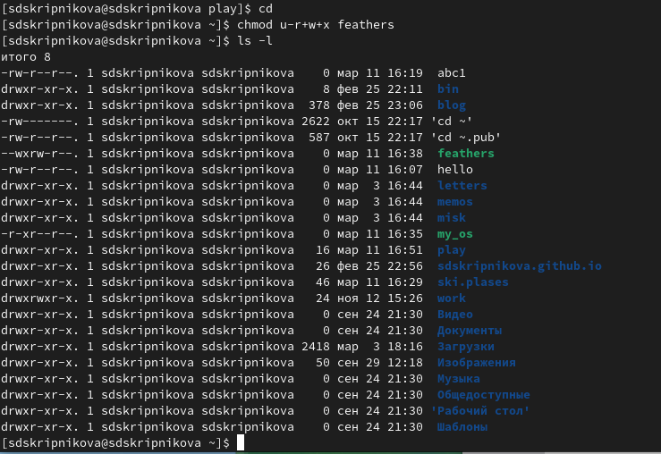{#fig:019 width=40%}

## Этап 4

- Я попыталась просмотреть файл ~/feathers командой cat, мне было отказано в доступе, так как файл был лишен права на чтение.

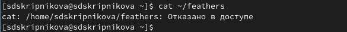{#fig:020 width=40%}

- Когда я попыталась скопировать файл ~/feathers, мне было отказано в доступе, так как файл лишен права на чтение.

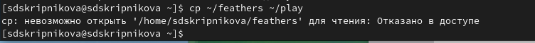{#fig:021 width=40%}

## Этап 4

- Дала владельцу файла ~/feathers право на чтение.

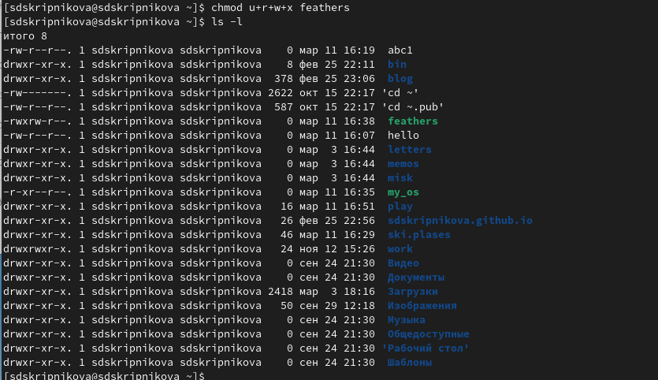{#fig:022 width=40%}

## Этап 4

- Лишила владельца каталога ~/play права на выполнение.

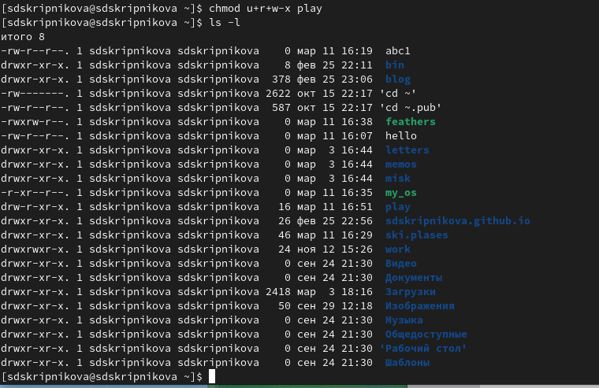{#fig:023 width=40%}

## Этап 4

- Перешла в каталог ~/play. Увидела, что мне отказано в доступе, так как нет права на выполнение.

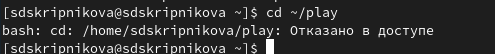{#fig:024 width=40%}

## Этап 5

-Используя команды «man mount», «man fsck», «man mkfs», «man kill», получим информацию о соответствующих командах:

- Команда mount: предназначена для монтирования файловой системы. Все файлы, доступные в Unix системах, составляют иерархическую файловую структуру, которая имеет ветки (каталоги) и листья (файлы в каталогах). Корень этого дерева обозначается как /. Физически файлы могут располагаться на различных устройствах. Команда mount служит для подключения файловых систем разных устройств к этому большому дереву. 

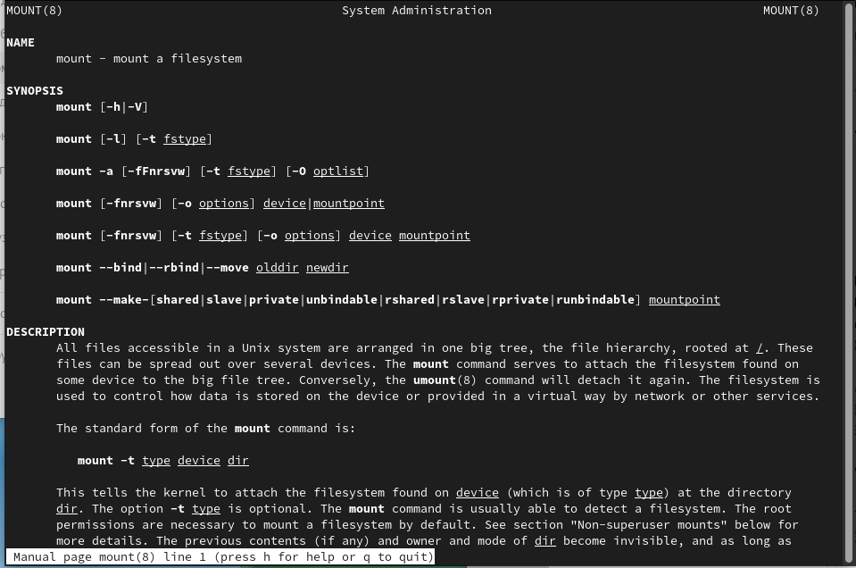{#fig:025 width=40%}

## Этап 5

- Команда fsck: это утилита командной строки, которая позволяет выполнять проверки согласованности и интерактивное исправление в одной или нескольких файловых системах Linux. Он использует программы, специфичные для типа файловой системы, которую он проверяет. У команды fsck следующий синтаксис: fsck [параметр] -- [параметры ФС] [<файловая система> . . .] Например, если нужно восстановить («починить») файловую систему на некотором устройстве /dev/sdb2, следует воспользоваться командой: «sudo fsck -y /dev/sdb2» 

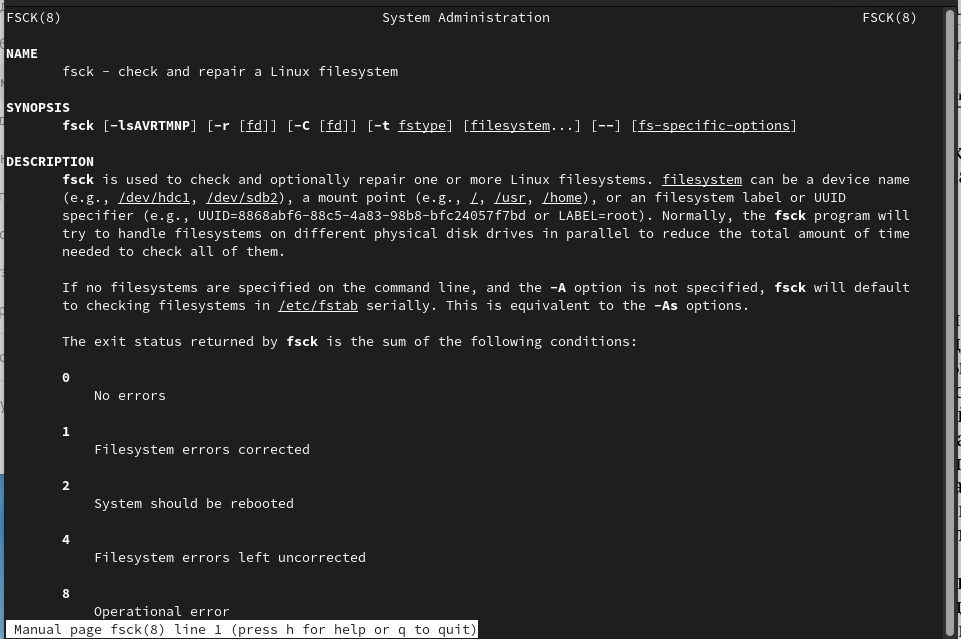{#fig:026 width=40%}

## Этап 5

- Команда mkfs: создаёт новую файловую систему Linux. Имеет следующий синтаксис: mkfs [ -V ] [ -t fstype ] [ fs-options ] filesys [ blocks ] mkfs используется для создания файловой системы Linux на некотором устройстве, обычно в разделе жёсткого диска. В качестве аргумента filesys для файловой системы может выступать или название устройства (например, /dev/hda1, /dev/sdb2) или точка монтирования (например, /, /usr, /home).

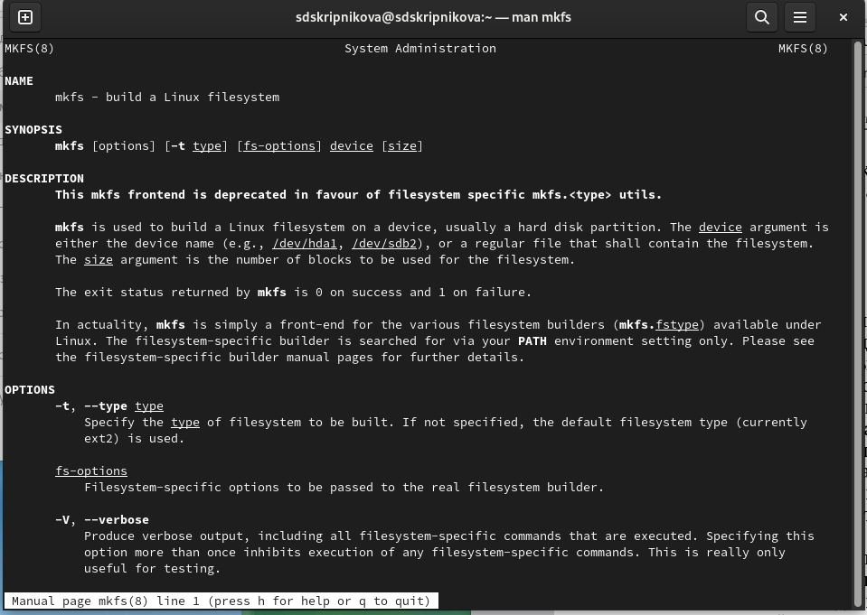{#fig:027 width=40%}

## Этап 5

- Команда kill: посылает сигнал процессу или выводит список допустимых сигналов. Имеет следующий синтаксис: kill [опции] PID, где PID – это PID (числовой идентификатор) процесса или несколько PID процессов, если требуется послать сигнал сразу нескольким процессам. Например, команда «kill -KILL 3121» посылает сигнал KILL процессу с PID 3121, чтобы принудительно завершить процесс 

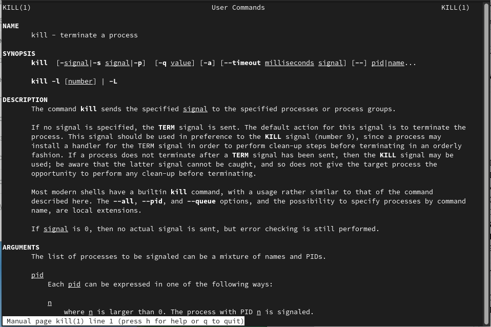{#fig:028 width=40%}

# Заключение

## Вывод 

В ходе выполнения данной лабораторной работы я ознакомилась с файловой системой Linux, её структурой, именами и содержанием каталогов, получила навыки по применению команд для работы с файлами и каталогами, по управлению процессами (и работами), по проверке использования диска и обслуживанию файловой системы.

