---
## Front matter
lang: ru-RU
title: Лабораторной работы №3
subtitle: Дисциплина "Операционные системы"
author:
  - Обрезкова А.В.
institute:
  - Российский университет дружбы народов, Москва, Россия
  - ФФМиЕН
date: 18 февраля 2023

## i18n babel
babel-lang: russian
babel-otherlangs: english

## Formatting pdf
toc: false
toc-title: Содержание
slide_level: 2
aspectratio: 169
section-titles: true
theme: metropolis
header-includes:
 - \metroset{progressbar=frametitle,sectionpage=progressbar,numbering=fraction}
 - '\makeatletter'
 - '\beamer@ignorenonframefalse'
 - '\makeatother'
---

# Информация

## Докладчик

:::::::::::::: {.columns align=center}
::: {.column width="70%"}

  * Обрезкова Анастасия Владимировна
  * студентка направления "Математика и механика"
  * Российский университет дружбы народов
  * [1132226505@pfur.ru](1132226505@mail.ru)

:::
::: {.column width="30%"}

:::
::::::::::::::

# Вводная часть

## Цель работы

- Создание отчета по лабораторной работе №2

# Основная часть

## Перенос скриншотов

- Перенесла все скриншоты в нужную папку image.

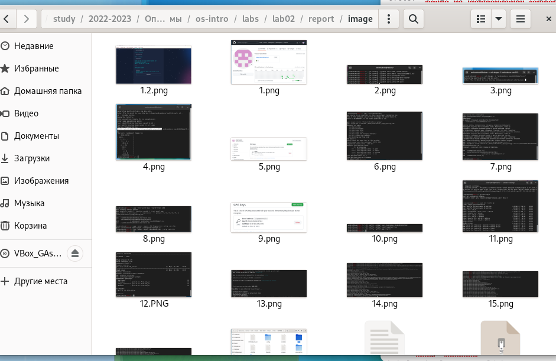

## Заголовок

- Откралы файл Markdown, ввела название работы и дисциплины

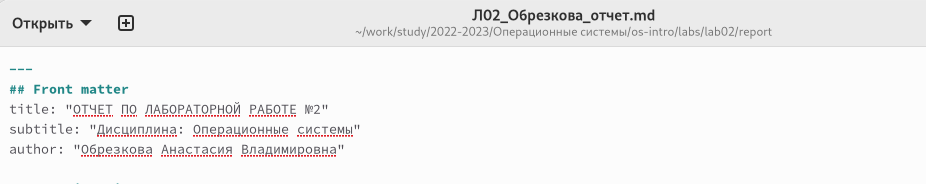

## Цели и задачи

- Заполинала цель работы и задачи, поставленные для выполнения лабораторной работы

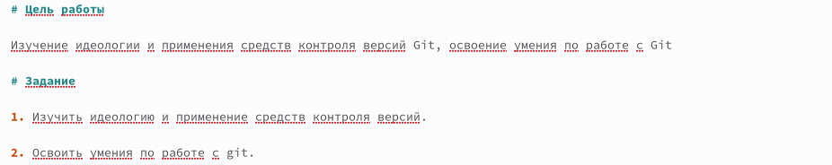

## Теория

- Написала теоретическое введение

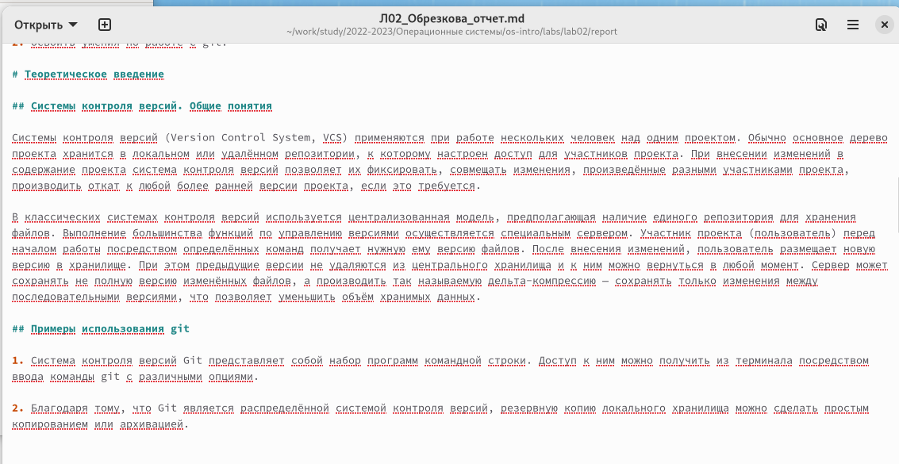

## Оглавление

- Написала нужные заголовки (#) и подзаголовки (##)

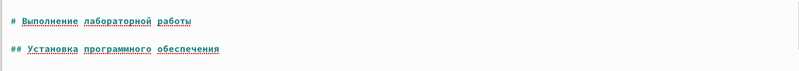

## Оснавная часть

- Прописала действия, которые делала при выполнении работы

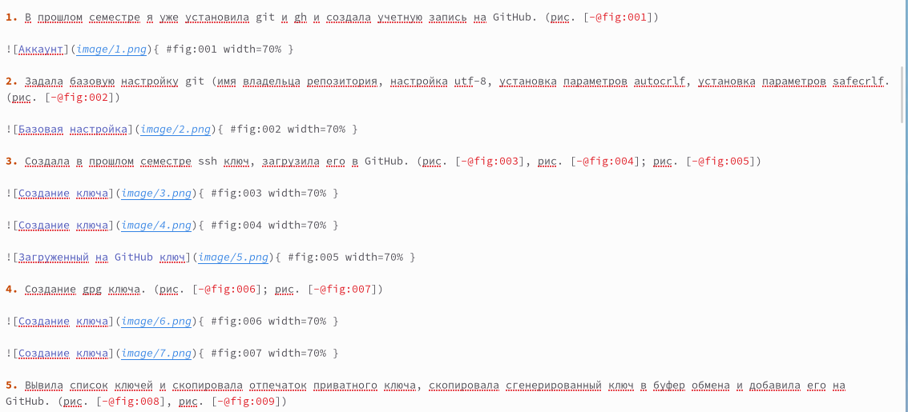

## Ссылки

- Прикрепила ссылку на GitHub

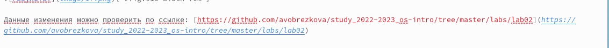

## Контрольные вопросы

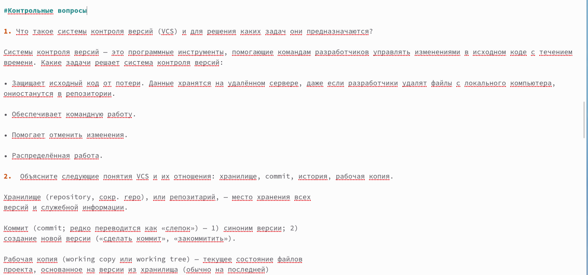

## Вывод и список литературы

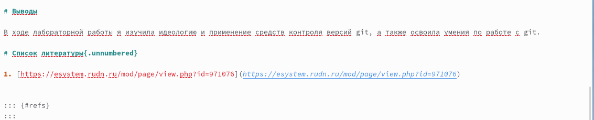

## Команды Make

- С помощью команды создала файлы в формате docx и pdf

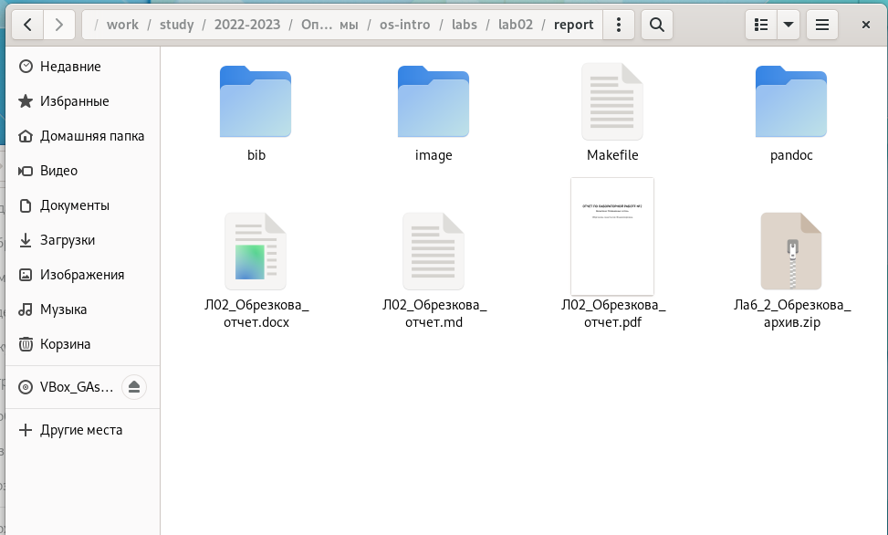

## GitHub

- Загрузила файлы на GitHub

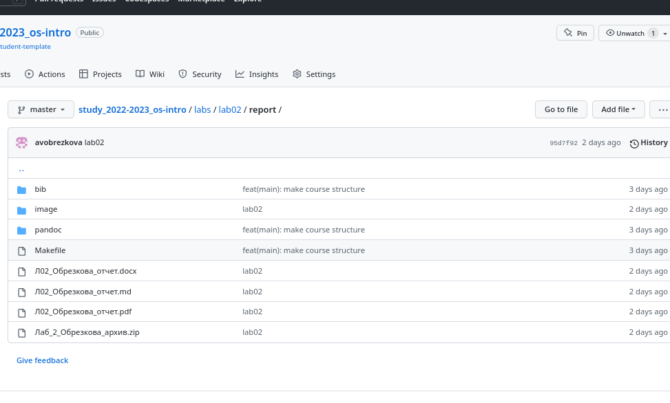

# Заключение

## Вывод

В ходе выполнения лабораторной работы я создала отчет лабораторной работы №2.

