---
## Front matter
title: "ОТЧЕТ ПО ЛАБОРАТОРНОЙ РАБОТЕ №5"
subtitle: "Дисциплина: Операционные системы"
author: "Скрипникова София Дмитриевна"

## Generic otions
lang: ru-RU
toc-title: "Содержание"

## Bibliography
bibliography: bib/cite.bib
csl: pandoc/csl/gost-r-7-0-5-2008-numeric.csl

## Pdf output format
toc: true # Table of contents
toc-depth: 2
lof: true # List of figures
lot: true # List of tables
fontsize: 12pt
linestretch: 1.5
papersize: a4
documentclass: scrreprt
## I18n polyglossia
polyglossia-lang:
  name: russian
  options:
	- spelling=modern
	- babelshorthands=true
polyglossia-otherlangs:
  name: english
## I18n babel
babel-lang: russian
babel-otherlangs: english
## Fonts
mainfont: PT Serif
romanfont: PT Serif
sansfont: PT Sans
monofont: PT Mono
mainfontoptions: Ligatures=TeX
romanfontoptions: Ligatures=TeX
sansfontoptions: Ligatures=TeX,Scale=MatchLowercase
monofontoptions: Scale=MatchLowercase,Scale=0.9
## Biblatex
biblatex: true
biblio-style: "gost-numeric"
biblatexoptions:
  - parentracker=true
  - backend=biber
  - hyperref=auto
  - language=auto
  - autolang=other*
  - citestyle=gost-numeric
## Pandoc-crossref LaTeX customization
figureTitle: "Рис."
tableTitle: "Таблица"
listingTitle: "Листинг"
lofTitle: "Список иллюстраций"
lotTitle: "Список таблиц"
lolTitle: "Листинги"
## Misc options
indent: true
header-includes:
  - \usepackage{indentfirst}
  - \usepackage{float} # keep figures where there are in the text
  - \floatplacement{figure}{H} # keep figures where there are in the text
---

# Цель работы

Ознакомление с файловой системой Linux, её структурой, именами и содержанием каталогов. Приобретение практических навыков по применению команд для работы с файлами и каталогами, по управлению процессами (и работами), по проверке использования диска и обслуживанию файловой системы.

# Задание

1. Ознакомиться с файловой системой Linux, её структурой, именами и содержанием каталогов.

2. Приобрести практические навыки по применению команд для работы с файлами и каталогами

# Теоретическое введение

## Команды для работы с файлами и каталогами

- Для создания текстового файла можно использовать команду touch.

- Для просмотра файлов небольшого размера можно использовать команду cat.

- Для просмотра файлов постранично удобнее использовать команду less.

- Команда head выводит по умолчанию первые 10 строк файла.

- Команда tail выводит умолчанию 10 последних строк файла.

## Копирование файлов и каталогов

- Команда cp используется для копирования файлов и каталогов.

- Опция i в команде cp выведет на экран запрос подтверждения о перезаписи файла.

- Для рекурсивного копирования каталогов, содержащих файлы, используется команда cp с опцией r.

## Перемещение и переименование файлов и каталогов

- Команды mv и mvdir предназначены для перемещения и переименования файлов и каталогов.

## Права доступа

Каждый файл или каталог имеет права доступа.

В сведениях о файле или каталоге указываются:

– тип файла (символ (-) обозначает файл, а символ (d) — каталог)

– права для владельца файла (r — разрешено чтение, w — разрешена запись, x — разрешено выполнение, - — право доступа отсутствует)

– права для членов группы (r — разрешено чтение, w — разрешена запись, x — разрешено выполнение, - — право доступа отсутствует)

– права для всех остальных (r — разрешено чтение, w — разрешена запись, x — разрешено выполнение, - — право доступа отсутствует)

## Изменение прав доступа

Права доступа к файлу или каталогу можно изменить, воспользовавшись командой chmod.

Режим (в формате команды) имеет следующие компоненты структуры и способ записи:

= установить право

- лишить права

+ дать право

r чтение

w запись

x выполнение

u (user) владелец файла

g (group) группа, к которой принадлежит владелец файла

o (others) все остальные

# Выполнение лабораторной работы

## Часть 1

1. Выполнила все примеры, приведённые в первой части описания лабораторной работы. (рис. [-@fig:001])

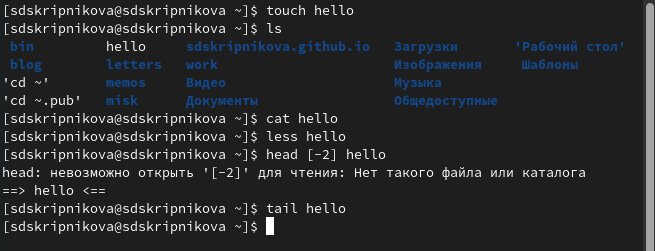{ #fig:001 width=70% }

## Часть 2

1. Скопируйте файл /usr/include/sys/io.h в домашний каталог и назовите его equipment. (рис. [-@fig:002])

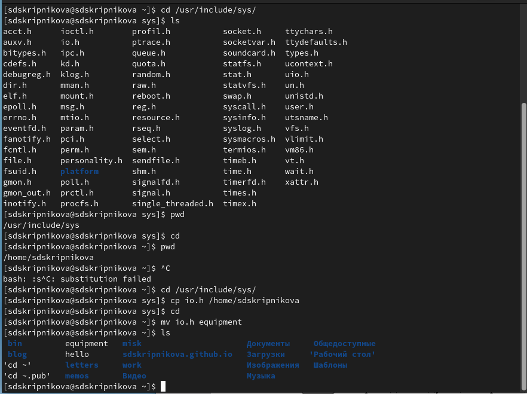{ #fig:002 width=70% }

2. В домашнем каталоге создала директорию ~/ski.plases. (рис. [-@fig:003])

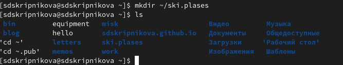{ #fig:003 width=70% }

3. Переместила файл equipment в каталог ~/ski.plases. (рис. [-@fig:004])

.PNG){ #fig:004 width=70% }

4. Переименовала файл ~/ski.plases/equipment в ~/ski.plases/equiplist. (рис. [-@fig:005])

.PNG){ #fig:005 width=70% }

5. Создала в домашнем каталоге файл abc1 и скопировала его в каталог ~/ski.plases, назвала его equiplist2. (рис. [-@fig:006])

.PNG){ #fig:006 width=70% }

6. Создала каталог с именем equipment в каталоге ~/ski.plases. (рис. [-@fig:007])

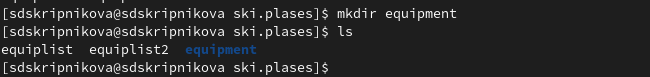{ #fig:007 width=70% }

7. Переместила файлы ~/ski.plases/equiplist и equiplist2 в каталог ~/ski.plases/equipment. (рис. [-@fig:008])

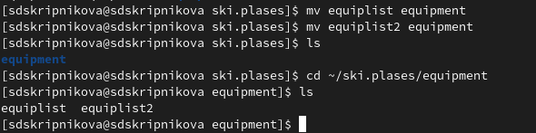{ #fig:008 width=70% }

8. Создала и переместила каталог ~/newdir в каталог ~/ski.plases и назвала его plans.(рис. [-@fig:009])

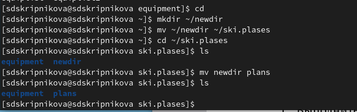{ #fig:009 width=70% }

## Этап 3

Определите опции команды chmod, необходимые для того, чтобы присвоить перечисленным ниже файлам выделенные права доступа, считая, что в начале таких прав нет. Сначала создала нужные файлы, используя команду mkdir. 

1. С помощью команды chmod файлу australia присвоила владельцу права чтения, записи и выполнения. Группе, к которой принадлежит владелец файла присвоила права чтения. Всем остальным присвоила права чтения. (рис. [-@fig:010])

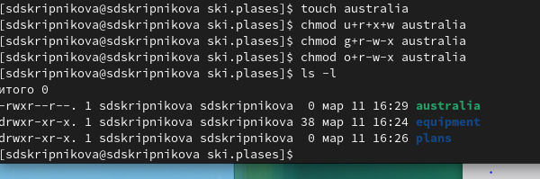{ #fig:010 width=70% }

2. С помощью команды chmod файлу play присвоила владельцу права чтения, записи и выполнения. Группе, к которой принадлежит владелец файла присвоила права выполнения. Всем остальным присвоила права выполнения. (рис. [-@fig:011]) 

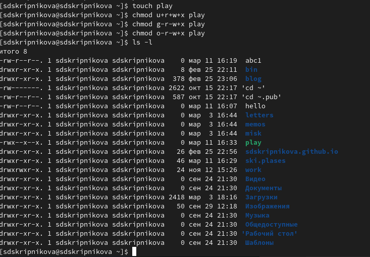{ #fig:011 width=70% }

3. С помощью команды chmod файлу my_os присвоила владельцу права чтения и выполнения. Группе, к которой принадлежит владелец файла присвоила права чтения. Всем остальным присвоила права чтения. (рис. [-@fig:012])

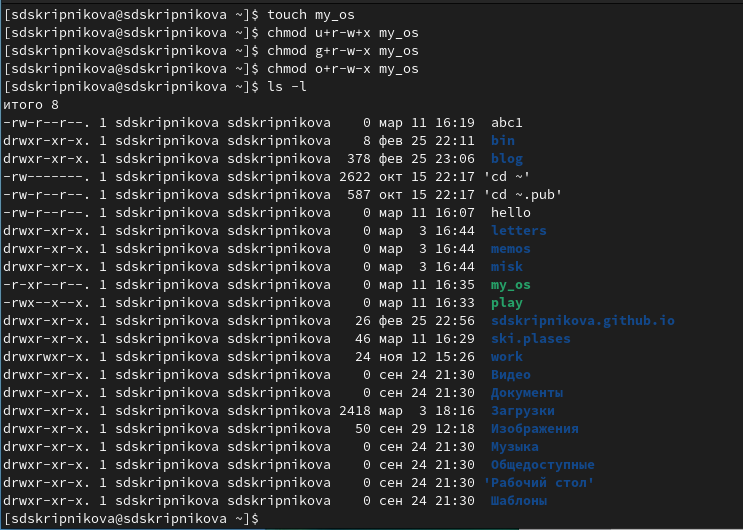{ #fig:012 width=70% }

4. С помощью команды chmod файлу feathers присвоила владельцу права чтения и записи. Группе, к которой принадлежит владелец файла присвоила права чтения и записи. Всем остальным присвоила права чтения. (рис. [-@fig:013])

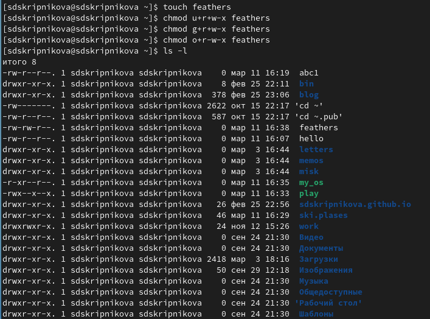{ #fig:013 width=70% }

## Этап 4

1. Просмотрела содержимое файла /etc/password. (рис. [-@fig:014])

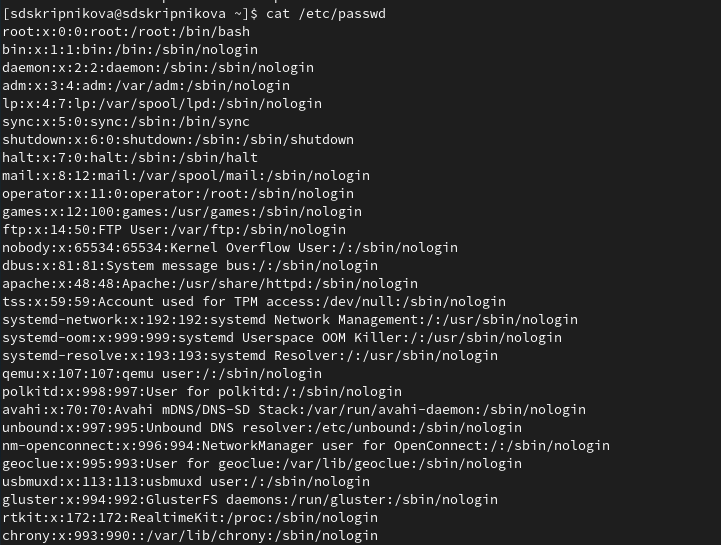{ #fig:014 width=70% }

2. Скопировала файл ~/feathers в файл ~/file.old. (рис. [-@fig:015])

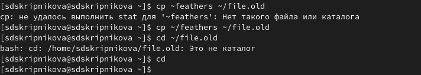{ #fig:015 width=70% }

3. Переместила файл ~/file.old в каталог ~/play. (рис. [-@fig:016])

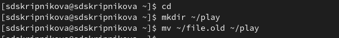{ #fig:016 width=70% }

4. Скопировала каталог ~/play в каталог ~/fun. (рис. [-@fig:017])

{ #fig:017 width=70% }

5. Переместила каталог ~/fun в каталог ~/play и назвала его games. (рис. [-@fig:018])

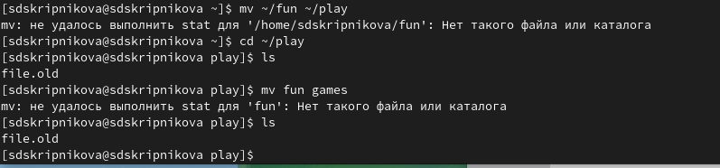{ #fig:018 width=70% }

6. Лишила владельца файла ~/feathers права на чтение. (рис. [-@fig:019])

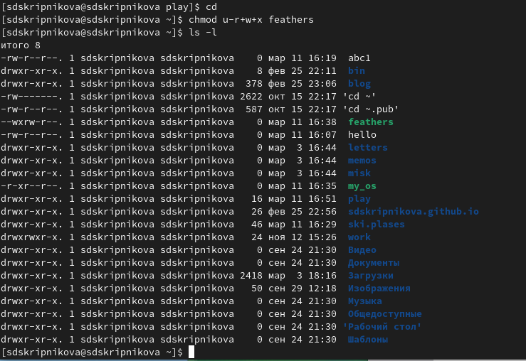{ #fig:019 width=70% }

7. Я попыталась просмотреть файл ~/feathers командой cat, мне было отказано в доступе, так как файл был лишен права на чтение.  (рис. [-@fig:020])

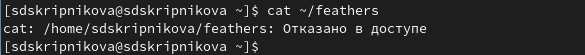{ #fig:020 width=70% }

8. Когда я попыталась скопировать файл ~/feathers, мне было отказано в доступе, так как файл лишен права на чтение(рис. [-@fig:021])

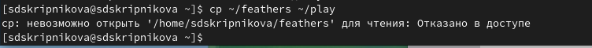{ #fig:021 width=70% }

9. Дала владельцу файла ~/feathers право на чтение. (рис. [-@fig:022])

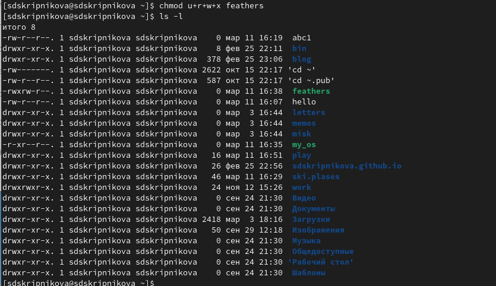{ #fig:022 width=70% }

10. Лишила владельца каталога ~/play права на выполнение. (рис. [-@fig:023])

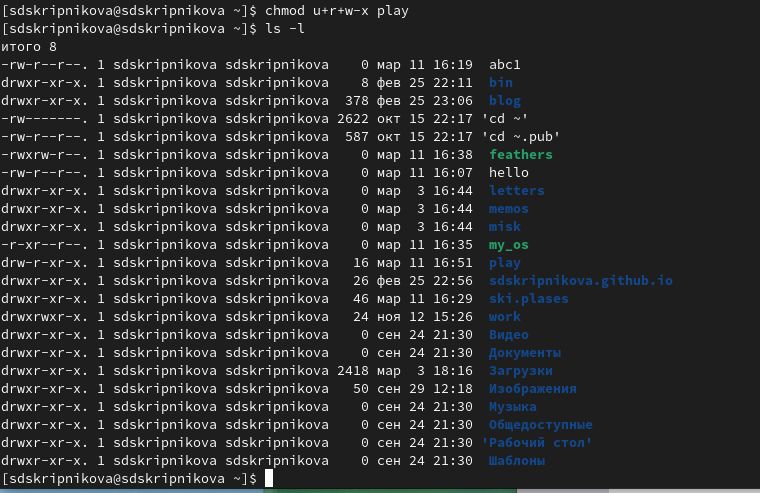{ #fig:023 width=70% }

11. Перешла в каталог ~/play. Увидела, что мне отказано в доступе, так как нет права на выполнение. (рис. [-@fig:024])

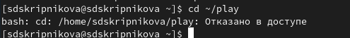{ #fig:024 width=70% }

## Этап 5

1. Прочитала man по командам mount, fsck, mkfs, kill. 

- Команда mount: предназначена для монтирования файловой системы. Все файлы, доступные в Unix системах, составляют иерархическую файловую структуру, которая имеет ветки (каталоги) и листья (файлы в каталогах). Корень этого дерева обозначается как /. Физически файлы могут располагаться на различных устройствах. Команда mount служит для подключения файловых систем разных устройств к этому большому дереву.(рис. [-@fig:025])

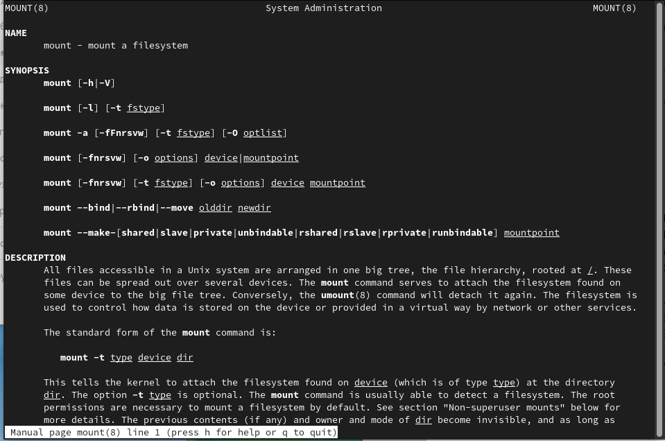{ #fig:025 width=70% }

- Команда fsck: это утилита командной строки, которая позволяет выполнять проверки согласованности и интерактивное исправление в одной или нескольких файловых системах Linux. Он использует программы, специфичные для типа файловой системы, которую он проверяет. У команды fsck следующий синтаксис: fsck [параметр] – [параметры ФС] [ ...] Например, если нужно восстановить («починить») файловую систему на некотором устройстве /dev/sdb2, следует воспользоваться командой: «sudo fsck -y /dev/sdb2» (рис. [-@fig:026])

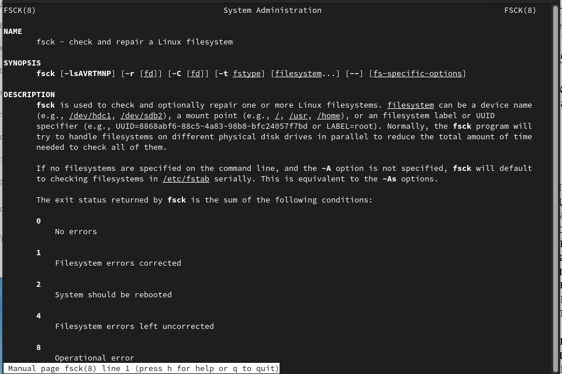{ #fig:026 width=70% }

- Команда mkfs: создаёт новую файловую систему Linux. Имеет следующий синтаксис: mkfs [ -V ] [ -t fstype ] [ fs-options ] filesys [ blocks ] mkfs используется для создания файловой системы Linux на некотором устройстве, обычно в разделе жёсткого диска. В качестве аргумента filesys для файловой системы может выступать или название устройства (например, /dev/hda1,
/dev/sdb2) или точка монтирования (например, /, /usr, /home) (рис. [-@fig:027])

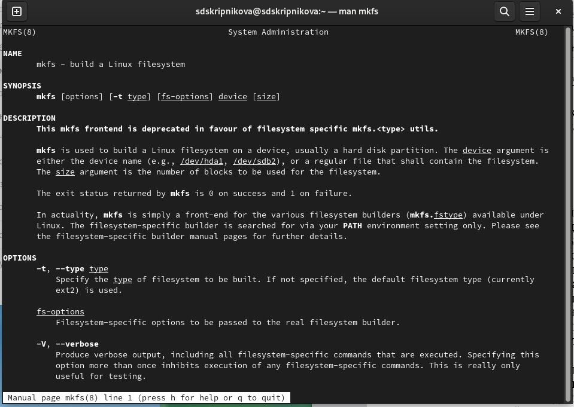{ #fig:027 width=70% }

- Команда kill: посылает сигнал процессу или выводит список допустимых сигналов. Имеет следующий синтаксис: kill [опции] PID, где PID – это PID (числовой идентификатор) процесса или несколько PID процессов, если требуется послать сигнал сразу нескольким процессам. Например, команда «kill -KILL 3121» посылает сигнал KILL процессу с PID 3121, чтобы принудительно завершить процесс(рис. [-@fig:028])

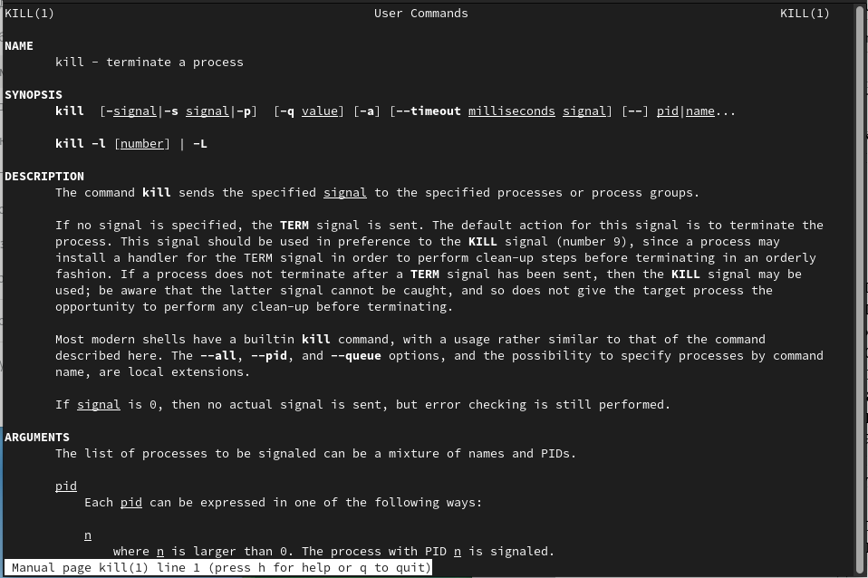{ #fig:028 width=70% }

# Выводы

В ходе выполнения данной лабораторной работы я ознакомилась с файловой системой Linux, её структурой, именами и содержанием каталогов, получила навыки по применению команд для работы с файлами и каталогами, по управлению процессами (и работами), по проверке использования диска и обслуживанию файловой системы.

#Контрольные вопросы

1. Дайте характеристику каждой файловой системе, существующей на жёстком диске компьютера, на котором вы выполняли лабораторную работу.

Чтобы узнать, какие файловые системы существуют на жёстком диске моего компьютера, использую команду «df -Th». Из рисунка видно, что на моем компьютере есть следующие файловые системы: devtmpfs, tmpfs, ext4, iso9660. devtmpfs позволяет ядру создать экземпляр tmpfs с
именем devtmpfs при инициализации ядра, прежде чем регистрируется какое-либо устройство с драйверами. Каждое устройство с майором / минором будет предоставлять узел устройства в devtmpfs. devtmpfs монтируется на /dev и содержит специальные файлы устройств для всех устройств. tmpfs − временное файловое хранилище во многих Unix-подобных ОС. Предназначена для монтирования файловой системы, но размещается в ОЗУ вместо ПЗУ. Подобная конструкция является RAM диском. Данная файловая система также предназначенная для быстрого и ненадёжного хранения временных данных. Хорошо подходит для /tmp и массовой сборки пакетов/образов. Предполагает наличие достаточного объёма виртуальной памяти. Файловая система tmpfs предназначена для того, чтобы использовать часть физической памяти сервера как обычный дисковый раздел, в котором можно сохранять данные (чтение и запись). Поскольку данные размещены в памяти, то чтение или запись происходят во много раз быстрее, чем с обычного HDD диска. ext4 − имеет обратную совместимость с предыдущими версиями ФС. Эта версия была выпущена в 2008 году. Является первой ФС из «семейства» Ext, использующая механизм «extent file system», который позволяет добиться меньшей фрагментации файлов и увеличить общую производительность файловой системы. Кроме того, в Ext4 реализован механизм отложенной записи (delayed allocation − delalloc), который так же уменьшает фрагментацию диска и снижает нагрузку на CPU. С другой стороны, хотя механизм отложенной записи и используется во многих ФС, но в силу сложности своей реализации он повышает вероятность утери данных.

Характеристики: 
• максимальный размер файла: 16 TB; 

• максимальный размер раздела: 16 TB; 

• максимальный размер имени файла: 255 символов.

Рекомендации по использованию: 

• наилучший выбор для SSD; 

• наилучшая производительность по сравнению с предыдущими Etx- системами; 

• она так же отлично подходит в качестве файловой системы для серверов баз данных, хотя сама система и моложе Ext3. ISO 9660 − стандарт, выпущенный Международной организацией по стандартизации, описывающий файловую систему для дисков CD- ROM. Также известен как CDFS (Compact
Disc File System). Целью стандарта является обеспечить совместимость носителей под разными операционными системами, такими, как Unix, Mac
OS, Windows.

2. Приведите общую структуру файловой системы и дайте характеристику каждой директории первого уровня этой структуры.

Файловая система Linux/UNIX физически представляет собой пространство раздела диска разбитое на блоки фиксированного размера, кратные размеру сектора − 1024, 2048, 4096 или 8120 байт. Размер блока указывается при создании файловой системы. В файловой структуре Linux имеется один корневой раздел − / (он же root, корень). Все разделы жесткого диска (если их несколько) представляют собой структуру подкаталогов, “примонтированных” к определенным каталогам.

3. Какая операция должна быть выполнена, чтобы содержимое некоторой файловой системы было доступно операционной системе?

Чтобы содержимое некоторой файловой системы было доступно операционной системе необходимо воспользоваться командой mount.

4. Назовите основные причины нарушения целостности файловой системы. Как устранить повреждения файловой системы?

Целостность файловой системы может быть нарушена из-за перебоев в питании, неполадок в оборудовании или из-за некорректного/внезапного выключения компьютера. Чтобы устранить повреждения файловой системы необходимо использовать команду fsck.

5. Как создаётся файловая система?

Файловую систему можно создать, используя команду mkfs. Ее краткое описание дано в пункте 5) в ходе выполнения заданий лабораторной работы.

6. Дайте характеристику командам для просмотра текстовых файлов.

Для просмотра текстовых файлов существуют следующие команды: Задача команды cat очень проста − она читает данные из файла или стандартного ввода и выводит их на экран. 

Синтаксис утилиты: cat [опции] файл1 файл2

Основные опции: 

-b – нумеровать только непустые строки 

-E – показывать символ $ в конце каждой строки 

-n – нумеровать все строки

-s – удалять пустые повторяющиеся строки 

-T – отображать табуляции в виде 

^I -h – отобразить справку 

-v – версия утилиты 

Команда nl действует аналогично команде cat, но выводит еще и номера строк в столбце слева. Cущественно более развитая команда для пролистывания текста. При чтении данных со стандартного ввода она создает буфер, который позволяет листать текст как вперед, так и назад, а также искать как по направлению к концу, так и по направлению к началу текста. Синтаксис аналогичный синтаксису команды cat. 

Некоторые опции: 

-g – при поиске подсвечивать только текущее найденное слово (по умолчанию подсвечиваются все вхождения) 

-N – показывать номера строк 

Команда head выводит начальные строки (по умолчанию − 10) из одного или нескольких документов. Также она может показывать данные, которые передает на вывод другая утилита. Синтаксис аналогичный синтаксису команды cat. 

Основные опции: 

-c (–bytes) − позволяет задавать количество текста не в строках, а в байтах 

-n (–lines) − показывает заданное количество строк вместо 10, которые выводятся по умолчанию 

-q (–quiet, –silent) − выводит только текст, не добавляя к нему название файла 

-v (–verbose) − перед текстом выводит название файла 

-z (–zero-terminated) − символы перехода на новую строку заменяет символами завершения строк

Эта команда позволяет выводить заданное количество строк с конца файла, а также выводить новые строки в интерактивном режиме. Синтаксис аналогичный синтаксису команды cat. 

Основные опции: 

-c − выводить указанное количество байт с конца файла 

-f − обновлять информацию по мере появления новых строк в файле 

-n − выводить указанное количество строк из конца файла 

–pid − используется с опцией -f, позволяет завершить работу утилиты, когда завершится указанный процесс 

-q − не выводить имена файлов 

–retry − повторять попытки открыть файл, если он недоступен 

-v − выводить подробную информацию о файле

7. Приведите основные возможности команды cp в Linux.

Утилита cp позволяет полностью копировать файлы и директории. Cинтаксис: 

cp [опции] файл-источник файл-приемник 

После выполнения команды файл-источник будет полностью перенесен в файл-приемник. Если в конце указан слэш, файл будет записан в заданную директорию с оригинальным именем. Основные опции: 

–attributes-only − не копировать содержимое файла, а только флаги доступа и владельца -f, 

–force − перезаписывать существующие файлы -i, 

–interactive − спрашивать, нужно ли перезаписывать существующие файлы 

-L − копировать не символические ссылки, а то, на что они указывают 

-n − не перезаписывать существующие файлы 

-P − не следовать символическим ссылкам 

-r − копировать папку Linux рекурсивно

-s − не выполнять копирование файлов в Linux, а создавать символические ссылки 

-u − скопировать файл, только если он был изменён 

-x − не выходить за пределы этой файловой системы 

-p − сохранять владельца, временные метки и флаги доступа при копировании 

-t − считать файл-приемник директорией и копировать файл-источник в эту директорию

8. Приведите основные возможности команды mv в Linux.

Команда mv используется для перемещения одного или нескольких файлов (или директорий) в другую директорию, а также для переименования
файлов и директорий. Синтаксис: 

mv [-опции] старый_файл новый_файл

Основные опции: 

–help − выводит на экран официальную документацию об утилите 

–version − отображает версию mv 

-b − создает копию файлов, которые были перемещены или перезаписаны 

-f − при активации не будет спрашивать разрешение у владельца файла, если речь идет о перемещении или переименовании файла 

-i − наоборот, будет спрашивать разрешение у владельца 

-n − отключает перезапись уже существующих объектов 

–strip-trailing-slashes — удаляет завершающий символ / у файла при его наличии

-t [директория] — перемещает все файлы в указанную директорию 

-u − осуществляет перемещение только в том случае, если исходный файл новее объекта назначения 

-v − отображает сведения о каждом элементе во время обработки команды 

Команда rename также предназначена, чтобы переименовать файл. Синтаксис: 

rename [опции] старое_имя новое_имя

Основные опции: 

-v − вывести список обработанных файлов 

-n −тестовый режим, на самом деле никакие действия выполнены не будут 

-f −принудительно перезаписывать существующие файлы

9. Что такое права доступа? Как они могут быть изменены?

Права доступа − совокупность правил, регламентирующих порядок и условия доступа субъекта к объектам информационной системы (информации,
её носителям, процессам и другим ресурсам) установленных правовыми документами или собственником, владельцем информации. Права доступа к файлу или каталогу можно изменить, воспользовавшись командой chmod. Сделать это может владелец файла (или каталога) или пользователь с правами администратора. Синтаксис команды: chmod режим имя_файла Режим имеет следующие компоненты структуры и способ записи: = установить
право лишить права дать право r чтение w запись x выполнение u (user) владелец файла g (group) группа, к которой принадлежит владелец файла o (others) все остальные

# Список литературы{.unnumbered}

::: {#refs}
:::
