---
## Front matter
title: "Отчёт по лабораторной работе №6"
subtitle: "Операционные системы"
author: "Скрипникова София Дмитриевна"

## Generic otions
lang: ru-RU
toc-title: "Содержание"

## Bibliography
bibliography: bib/cite.bib
csl: pandoc/csl/gost-r-7-0-5-2008-numeric.csl

## Pdf output format
toc: true # Table of contents
toc-depth: 2
lof: true # List of figures
lot: true # List of tables
fontsize: 12pt
linestretch: 1.5
papersize: a4
documentclass: scrreprt
## I18n polyglossia
polyglossia-lang:
  name: russian
  options:
	- spelling=modern
	- babelshorthands=true
polyglossia-otherlangs:
  name: english
## I18n babel
babel-lang: russian
babel-otherlangs: english
## Fonts
mainfont: PT Serif
romanfont: PT Serif
sansfont: PT Sans
monofont: PT Mono
mainfontoptions: Ligatures=TeX
romanfontoptions: Ligatures=TeX
sansfontoptions: Ligatures=TeX,Scale=MatchLowercase
monofontoptions: Scale=MatchLowercase,Scale=0.9
## Biblatex
biblatex: true
biblio-style: "gost-numeric"
biblatexoptions:
  - parentracker=true
  - backend=biber
  - hyperref=auto
  - language=auto
  - autolang=other*
  - citestyle=gost-numeric
## Pandoc-crossref LaTeX customization
figureTitle: "Рис."
tableTitle: "Таблица"
listingTitle: "Листинг"
lofTitle: "Список иллюстраций"
lotTitle: "Список таблиц"
lolTitle: "Листинги"
## Misc options
indent: true
header-includes:
  - \usepackage{indentfirst}
  - \usepackage{float} # keep figures where there are in the text
  - \floatplacement{figure}{H} # keep figures where there are in the text
---

# Цель работы

Ознакомиться с инструментами поиска файлов и фильтрации текстовых данных.
Приобрести практические навыков: по управлению процессами (и заданиями), по
проверке использования диска и обслуживанию файловых систем.

# Выполнение лабораторной работы

1. Осуществили вход в систему, используя наше имя.

2. Далее запишем в файл *file.txt* названия файлов, содержащихся в каталоге */etc*. Для этого используем команду *ls -a /etc >file.txt*. С помощью команды *ls -a ~ - >> file.txt* дописываем в этот же файл названия файлов, содержащихся в домашнем каталоге. Для проверки действий испольузем команду *cat file.txt*.(рис. @fig:001).

{#fig:001 width=70%}

3. Нужно вывести имена всех файлов из *file.txt*, которые имею расширение *.conf* и записать их в новый текстовый файл *conf.txt*. Для этого используем команду *grep -e '\.conf$' file.txt > conf.txt*. Проверяем выполнение дейсвтий. (рис. @fig:002).

{#fig:002 width=70%}

4. Затем найдём файлы в домашнем каталоге, которые начинаются на *с*. Это можно сделать несколькими командами, которые представлены на рисунке. (рис. @fig:003)

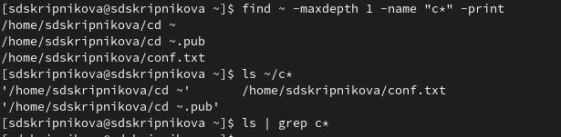{#fig:003 width=70%}

5. После этого выведем на экран (по странично) имена файлов из каталога */etc*, которые начинаются с символа *h*. Для этого я использовала команду * find /etc –maxdepth1 –name “h*”| less*. (рис. @fig:004)

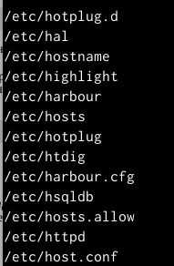{#fig:004 width=40%}

6. Запустим в фоновом режиме процесс, который будет записывать в файл *~/logfile*, файлы, которые начинаются с *log* с помощью команды *find / -name “log*” > logfile&»*. Запустился беспрерывный процесс записывания файла. (рис. @fig:005)

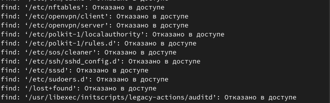{#fig:005 width=70%}

7. Проверим наличие файла *logfile*, а затем с помощью команды *rm logfile* удалим его. (рис. @fig:006)

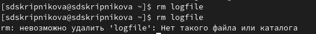{#fig:006 width=60%}

8. Заупскаем в консоли в фоном режиме редактор *gedit*. После ввода команды *gedit &* появляется окно редактора. (рис. @fig:007)

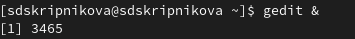{#fig:007 width=70%}

9. Для определения идентификатора процесса *gedit* используем команду *ps | grep-i "gedit"*. Из рисунка видно, что наш процесс имеет PID 4507. (рис. @fig:008)

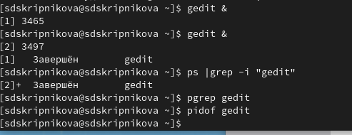{#fig:008 width=70%}

10. Далее ознакомимся со справкой команды *kill* и используем её для завершения процесса *gedit*. (рис. @fig:009),(рис. @fig:010)

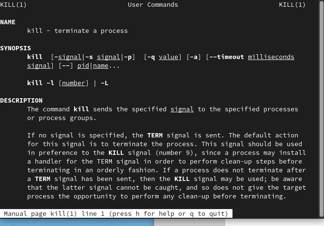{#fig:009 width=70%}

{#fig:010 width=70%}

11. Далее получим более подробную инофрмацию о командах *df* и *du*.
- df– утилита, показывающая список всех файловых систем по именам устройств, сообщает их размер, занятое и свободное пространство и точки монтирования.

- du – утилита, предназначенная для вывода ин-
формации об объеме дискового пространства, занятого файлами и директориями.Она принимает путь к элементу файловой системы и выводит информацию о
количестве байт дискового пространства или блоков диска, задействованных для его хранения (рис. @fig:011), (рис. @fig:012), (рис. @fig:013), (рис. @fig:014) 

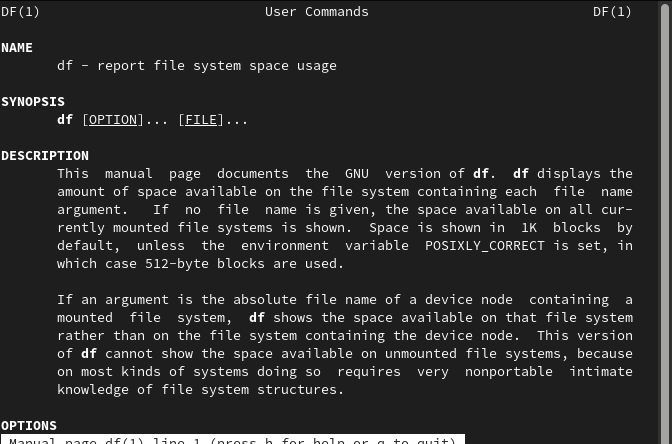{#fig:011 width=70%}

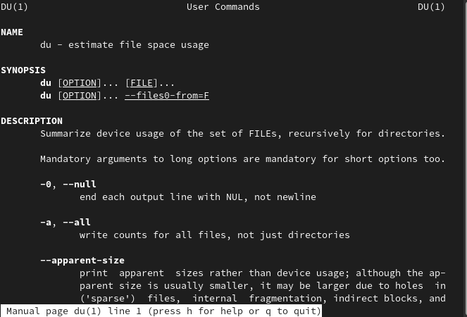{#fig:012 width=70%}

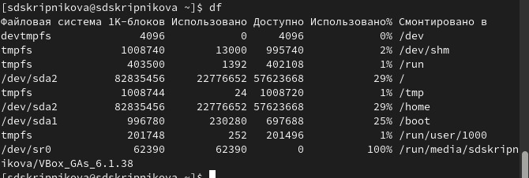{#fig:013 width=70%}

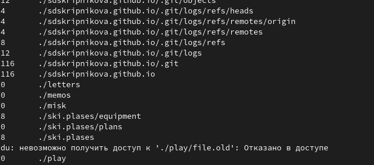{#fig:014 width=70%}

12. Выведем имена всех директорий, которые имеются в домашнем каталоге, предварительно узнаем опции команды *find*. (рис. @fig:015), (рис. @fig:016) 

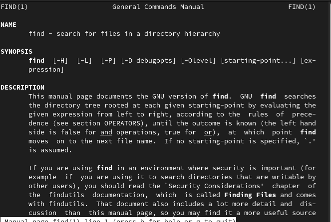{#fig:015 width=70%}

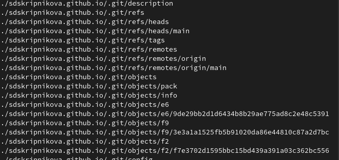{#fig:016 width=70%}

# Выводы

В ходе выполнения данной лабораторной работы я ознакомилась с инструментами поиска файлов и фильтрации текстовых данных, а также приобрела практические навыки по управлению процессами, по проверке использования диска и обслуживанию файловых систем.

# Ответы на контрольные вопросы

1. В системе по умолчанию открыто три специальных потока:

- stdin − стандартный поток ввода (по умолчанию: клавиатура), файловый
дескриптор 0;
- stdout − стандартный поток вывода (по умолчанию: консоль), файловый де-
скриптор 1;
- stderr − стандартный поток вывод сообщений об ошибках (поумолчанию:
консоль), файловый дескриптор 2.
Большинство используемых в консоли команд и программ записывают резуль-
таты своей работы в стандартный поток вывода stdout.

2. ‘>’ Перенаправление вывода в файл
‘»’ Перенаправление вывода в файл и открытие файла в режиме добавления
(данные добавляются в конец файла)/

3. Конвейер (pipe) служит для объединения простых команд или утилит в
цепочки, в которых результат работы предыдущей команды передаётся последу-
ющей.
Синтаксис следующий:

команда1|команда2 (это означает, что вывод команды 1 передастся на ввод
команде 2)

4. Процесс рассматривается операционной системой как заявка на потребле-
ние всех видов ресурсов, кроме одного − процессорного времени. Этот последний
важнейший ресурс распределяется операционной системой между другими еди-
ницами работы − потоками, которые и получили свое название благодаря тому,
что они представляют собой последовательности (потоки выполнения) команд.
Процесс − это выполнение программы. Он считается активной сущностью и
реализует действия, указанные в программе.
Программа представляет собой статический набор команд, а процесс это набор
ресурсов и данных, использующихся при выполнении программы.

5. 
- pid: идентификатор процесса (PID) процесса (processID), к которому вызы-
вают метод
- gid: идентификатор группы UNIX, в котором работает программа.

6. Любую выполняющуюся в консоли команду или внешнюю программу можно
запустить в фоновом режиме. Для этого следует в конце имени команды указать
знак амперсанда &.
Запущенные фоном программы называются задачами (jobs). Ими можно управ-
лять с помощью команды jobs, которая выводит список запущенных в данный
момент задач.

7. 
- top − это консольная программа, которая показывает список работающих
процессов в системе. Программа в реальном времени отсортирует запущенные
процессы по их нагрузке на процессор.

- htop − это продвинутый консольный мониторинг процессов. Утилита выводит
постоянно меняющийся список системных процессов, который сортируется в
зависимости от нагрузки на ЦПУ. Если делать сравнение сtop, то htop показыва-
ет абсолютно все процессы в системе, время их непрерывного использования,
загрузку процессоров и расход оперативной памяти.

8. find − это команда для поиска файлов и каталогов на основе специальных
условий. Ее можно использовать в различных обстоятельствах, например, для
поиска файлов по разрешениям, владельцам, группам, типу, размеру и другим
подобным критериям.
Команда find имеет такой синтаксис:

find[папка][параметры] критерий шаблон [действие]

Папка − каталог в котором будем искать

Параметры − дополнительные параметры, например, глубина поиска, и т д.

Критерий − по какому критерию будем искать: имя, дата создания, права,
владелец и т д.

Шаблон – непосредственно значение по которому будем отбирать файлы.

Основные параметры:
- -P никогда не открывать символические ссылки
- -L - получает информацию о файлах по символическим ссылкам. Важно для
дальнейшей обработки, чтобы обрабатывалась не ссылка, а сам файл.
- -maxdepth - максимальная глубина поиска по подкаталогам,для поиска только
в текущем каталоге установите 1.
- -depth - искать сначала в текущем каталоге, а потом в подкаталогах
- -mount искать файлы только в этой файловой системе.
- -version - показать версию утилиты find
- -print - выводить полные имена файлов
- -typef - искать только файлы
- -typed - поиск папки в Linux

Основные критерии:
- -name - поиск файлов по имени
- -perm - поиск файлов в Linux по режиму доступа
- -user - поиск файлов по владельцу
- -group - поиск по группе
- -mtime - поиск по времени модификации файла
- -atime - поиск файлов по дате последнего чтения
- -nogroup - поиск файлов, не принадлежащих ни одной группе
- -nouser - поиск файлов без владельцев
- -newer - найти файлы новее чем указанный
- -size - поиск файлов в Linux по их размеру

Примеры:

find~ -type d поиск директорий в домашнем каталоге

find~ -type f -name ”.*” поиск скрытых файлов в домашнем каталоге

9. Файл по его содержимому можно найти с помощью команды grep:

 «grep -r”слово/выражение, которое нужно найти”».
 
10. Утилита df, позволяет проанализировать свободное пространство на всех
подключенных к системе разделах.

11. При выполнении команды du (без указания папки и опции) можно полу-
чить все файлы и папки текущей директории с их размерами. Для домашнего
каталога: du ~/

12. Основные сигналы (каждый сигнал имеет свой номер), которые использу-
ются для завершения процесса:
- SIGINT–самый безобидный сигнал завершения, означает Interrupt. Он от-
правляется процессу, запущенному из терминала с помощью сочетания
клавиш Ctrl+C. Процесс правильно завершает все свои действия и возвра-
щает управление;
- SIGQUIT–это еще один сигнал, который отправляется с помощью сочетания
клавиш, программе, запущенной в терминале. Он сообщает ей что нужно
завершиться и программа может выполнить корректное завершение или
проигнорировать сигнал. В отличие от предыдущего, она генерирует дамп
памяти. Сочетание клавиш Ctrl+/;
- SIGHUP–сообщает процессу, что соединение с управляющим терминалом
разорвано, отправляется, в основном, системой при разрыве соединения синтернетом;
- SIGTERM–немедленно завершает процесс, но обрабатывается программой,
поэтому позволяет ей завершить дочерние процессы и освободить все ре-
сурсы;
- SIGKILL–тоже немедленно завершает процесс, но, в отличие от предыдуще-
го варианта, он не передается самому процессу, а обрабатывается ядром.
Поэтому ресурсы и дочерние процессы остаются запущенными.
Также для передачи сигналов процессам в Linux используется утилита kill,
её синтаксис: 
kill [-сигнал] [pid_процесса] 

(PID – уникальный идентификатор
процесса). Сигнал представляет собой один из выше перечисленных сигналов
для завершения процесса.
П
еред тем, как выполнить остановку процесса, нужно определить его PID. Для
этого используют команды ps и grep. Команда ps предназначена для вывода спис-
ка активных процессов в системе и информации о них. Команда grep запускается
одновременно с ps (вканале) и будет выполнять поиск по результатам команды
ps.

Утилита pkill – это оболочка для kill, она ведет себя точно так же, и имеет тот
же синтаксис, только в качестве идентификатора процесса ей нужно передать ег
оимя.

killall работает аналогично двум предыдущим утилитам. Она тоже принимает
имя процесса в качестве параметра и ищет его PID в директории /proc. Но эта
утилита обнаружит все процессы с таким именем и завершит их.
