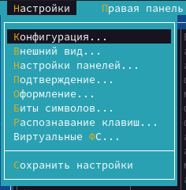

---
## Front matter
lang: ru-RU
title: Презентация по лабораторной работе №7
subtitle: Операционные системы
author:
  - Cкрипникова София Дмитриевна
institute:
  - Российский университет дружбы народов, Москва, Россия
date: 25 марта 2023
## i18n babel
babel-lang: russian
babel-otherlangs: english

## Formatting pdf
toc: false
toc-title: Содержание
slide_level: 2
aspectratio: 169
section-titles: true
theme: metropolis
header-includes:
 - \metroset{progressbar=frametitle,sectionpage=progressbar,numbering=fraction}
 - '\makeatletter'
 - '\beamer@ignorenonframefalse'
 - '\makeatother'
---

# Цель работы

Освоение основных возможностей командной оболочки Midnight Commander.
Приобретение навыков практической работы по просмотру каталогов и файлов;
манипуляций с ними

## Выполнение лабораторной работы

1. Задание по *mc*.

Изучаем информацию о mc, вызвав в командной строке man mc

{#fig:001 width=40%}

##

2. Запустим из командной строки mc и изучим его структуру и меню. Видим, что верхнее меню содержит “Левая панель”, “Файл”, “Команда”, “Настройки”, “Правая панель”. Также, начав клавиши F1 и F2 мы можем открыть “Помощь” или “Меню пользователя”.

{#fig:002 width=40%}

##

{#fig:003 width=40%}

{#fig:004 width=40%}

##

3. Выполним несколько операций в mc. Выделение и отмена выделения файлов. Для этого используем “shift”+стрелку вниз.

{#fig:005 width=40%}

Копирование и перемещение файлов. Для копирования используем клафишу “F5”, а для перемещения “F6”

##

{#fig:006 width=40%}

{#fig:007 width=40%}

##

После этого выполним команду для получения информации о размерах и правах доступа на файлы и/или каталоги. Это делаем таким путём: “Левая панель”-“Информация”.

{#fig:008 width=40%}

{#fig:009 width=30%}

##

4. Выполним основные команды меню левой панели.

{#fig:010 width=30%}

##

"Список файлов” отображает размер файла и время его правки.

{#fig:011 width=30%}

##

Быстрый просмотр” необходим для просмотра сожержания файлов. Пункт “Информация” отображает подробные данные для о файле

{#fig:012 width=30%}

##

Пункт “Дерево” необходим для просмотра дерева каталога.

{#fig:013 width=30%}

##

“Формат списка” 

- “Укороченный” отображает только имя файла или каталога.

- “Расширенный” отображает подробную информацию о файлах.

- ”Определённый пользователем” даёт возможность самостоятельно изменять степень подробнотио файле. 

- “Стандартный” ставится по умолчанию. 

{#fig:014 width=30%}

##

Пункт “Фильтр” необходим для того, чтобы просмотреть название файлов
или каталогов, которые подходят под указанную маску.

“Порядок сортировки” необходим для сортировки файлов ил каталогов по конкретному критерию.

##

5. С помощью фозможностей подменю “Файл” выполним следующие действия. 

{#fig:015 width=40%}

##

Для просмотра содержимого файла выберем пункт “Просмотр файла”. 

{#fig:016 width=40%}

##

Для редактирования содержимого текстового файла перейдём в пункт “Правка” и изменим на “Hello”

{#fig:017 width=40%}

##

Для создания каталога переходим в пункт “Создание каталога”. Я создам каталог “Hello”

{#fig:018 width=40%}

##

Копирование файлов в созданный каталог происходит с помощью выбора пункта “Копирование”. Выделим несколько файлов и пернесём их в каталог.

{#fig:019 width=40%}

##

6. С помощью средств подменю “Команда” осуществим следующие действия:поиск в файловой системе файла с заданными условия. Задаим условия “От каталога /,”Шаблон имени”*.сpp, “Содержимое”main. 

{#fig:020 width=30%}

{#fig:021 width=30%}

##

Затем для выбора и повторения одной из предыдущих комнад перейдём в
“История командной строки”-“История” внизу экрана, но это сноска пустая, т.к. не была использована командная строка.

{#fig:022 width=40%}

##

Для перехода в домашний каталог переходим в пункт “Дерево каталогов” и выбираем необходимый каталог. 

{#fig:023 width=40%}

##

Для анализа файла меню и файла расширение переходим в пункт “Редактировать файл расширений

{#fig:024 width=40%}

##

7. Вызовем подменю “Найстройки”. Освоим операции: “Конфигурация” позволяет скорректировать найстройки работы с панелями. “Внешний вид”-
“Настройка панелей” помогают определить элементы, отображаемые при вызове mc. Пункт “Подтверждение” помогаем установить или убрать вывод окна с хапросом подтверждения действий при операциях удаления и перезаписи файлов. Пунк “Оформление” даёт возможность менять цветовую гамму визуальной оболочки. А с помощью пункта “Сохранить настройки”
сохраняем изменения

{#fig:025 width=25%}

##

2. Задание по встроенному редактору mc

1. Создаём текстовый файл “text.txt”, командой “ls” проверяем выполнение действий. 

2. Открываем этот файл с помощью встроенного mc редактора с помощью команды “mcedit text.txt”.

{#fig:026 width=40%}

##

3. Вставим любой текстиз интернета и сделаем с ним следующие изменения.

{#fig:027 width=40%}

##

4. Удалим некую строчку стихотворения с помощью команды “F8”.

{#fig:028 width=40%}

##

Выделим фрагмент текста с помощью “F3” и скопируем его на новую строку с помощью клавиши”F5”. 

{#fig:029 width=40%}

##

Сохраним файл с помощью клавиши “F2”.И отменим последнее действие с
помощью клавиш “ctrl+u”.

{#fig:030 width=40%}

##

Для перехода в конец файла используем сочетание клавиш “ctrl+end”, и напишем автора стихотворения.

{#fig:031 width=40%}

##

Для перехода в начало испольузем “ctrl+home” и напишем заголовок. 

{#fig:032 width=40%}

Сохраним и выйдем в konsole.

##

5. Откроем файл с исходным текстом на некотором языке прогроммирования.
Введём команду “find / -name *.java”

{#fig:033 width=40%}

##

6. Используя меню редактора “Команда” - ” Отключить панели” мы можем включить/выключить подсветку строки.

{#fig:034 width=40%}

# Выводы

В процессе выполнения лабораторной работы я освоила основные возможности командной оболочки Midnight Commander.
Приобрила навыки практической работы по просмотру каталогов и файлов; манипуляций с ними

