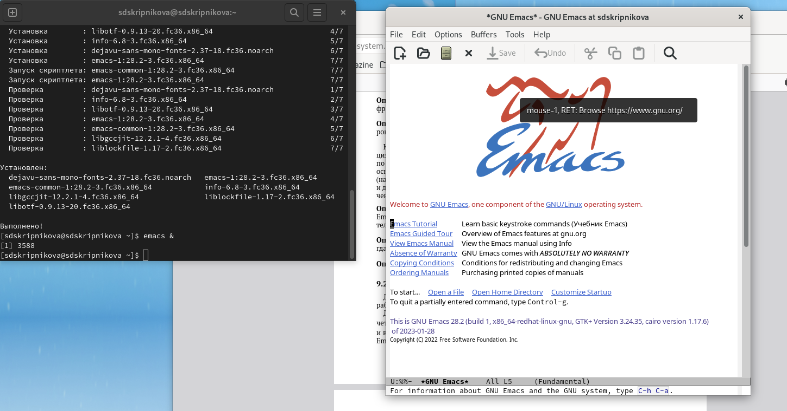
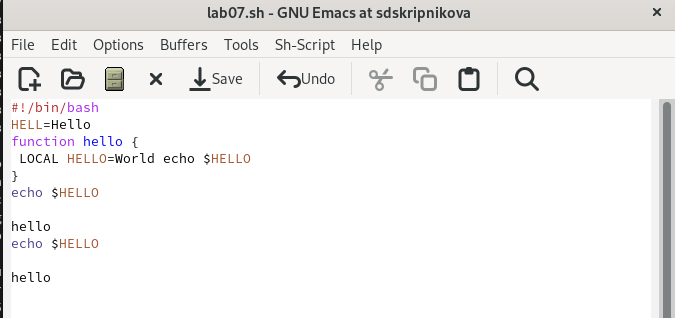

---
## Front matter
lang: ru-RU
title: Лабораторной работе №9
subtitle: Операционные системы
author:
  - Скрипникова София
institute:
  - Российский университет дружбы народов, Москва, Россия
  - ФФМиЕН
date: 25 марта 2023

## i18n babel
babel-lang: russian
babel-otherlangs: english

## Formatting pdf
toc: false
toc-title: Содержание
slide_level: 2
aspectratio: 169
section-titles: true
theme: metropolis
header-includes:
 - \metroset{progressbar=frametitle,sectionpage=progressbar,numbering=fraction}
 - '\makeatletter'
 - '\beamer@ignorenonframefalse'
 - '\makeatother'
---

# Информация

## Докладчик

:::::::::::::: {.columns align=center}
::: {.column width="70%"}

  * Обрезкова Анастасия Владимировна
  * студентка направления "Математика и механика"
  * Российский университет дружбы народов
  * [1132226523@pfur.ru](1132226523@mail.ru)

:::
::: {.column width="30%"}

:::
::::::::::::::
# Вводная часть

## Цель работы

Познакомиться с операционной системой Linux.Получить практические навыки работы с редактором Emacs.

## Задание

1. Ознакомиться с теоретическим материалом.

2. Ознакомиться с редактором emacs.

3. Выполнить упражнения.

4. Ответить на контрольные вопросы.

# Основная часть

## Выполнение лабораторной работы

- Открыла emacs.

##

- Создала файл lab07.sh с помощью комбинации Ctrl-x, Ctrl-f (C-x C-f).

##

- Набрала текст.

##

- Сохранила файл с помощью комбинации Ctrl-x, Ctrl-s (C-x C-s)

## Стандартные процедуры редактирования

- Вырезала одной командой целую строку (С-k).

## Стандартные процедуры редактирования

- Вставила эту строку в конец файла (C-y).

## Стандартные процедуры редактирования

- Выделила область текста (C-space)

## Стандартные процедуры редактирования

- Скопировала область в буфер обмена (M-w). 

- Вставила область в конец файла.

## Стандартные процедуры редактирования

- Вновь выделила эту область и на этот раз вырезала её (C-w).

## Стандартные процедуры редактирования

- Отменила последнее действие (C-/).

## Команды по перемещению курсора

- Переместила курсор в начало строки (C-a)

## Команды по перемещению курсора

- Переместила курсор в конец строки (C-e)

## Команды по перемещению курсора

- Переместила курсор в начало буфера (M-<)

## Команды по перемещению курсора

- Переместила курсор в конец буфера (M->)

## Управление буферами

- Вывела список активных буферов на экран (C-x C-b).

## Управление буферами

- Переместилась во вновь открытое окно (C-x) o со списком открытых буферов и переключилась на другой буфер.

## Управление буферами

- Закрыла это окно (C-x 0). 

## Управление буферами

- Теперь вновь переключилась между буферами, но уже без вывода их списка на экран (C-x b) 

## Управление окнами

- Поделила фрейм на 4 части: разделила фрейм на два окна по вертикали (C-x 3), а затем каждое из этих окон на две части по горизонтали (C-x 2)

## Управление окнами

- В каждом из четырёх созданных окон открыла новый буфер (файл) и ввела несколько строк текста.

## Режим поиска

- Переключлась в режим поиска (C-s) и нашла несколько слов, присутствующих в тексте.

## Режим поиска

- Переключилась между результатами поиска, нажимая C-s.

## Режим поиска

- Вышла из режима поиска, нажав C-g. 

## Режим поиска

- Перешла в режим поиска и замены (M-%), ввела текст, который следует найти и заменить, нажала Enter , затем ввела текст для замены. После того как будут подсвечены результаты поиска, нажала ! для подтверждения замены.

## Режим поиска

- Испробуйте другой режим поиска, нажав M-s o. Данный поиск отличается тем, что тут считывается строка поиска, которая трактуется как регулярное выражение, и не осуществляется поиск точного совпадения в тексте буфера. Регулярное выражение - это образец, который обозначает набор строк, возможно, и неограничнный набор

# Заключение

## Выводы

В ходе выполнения данной лабораторной работы я познакомилась с операционной системой Lunix и получила практические навыки по работе с редактором Emacs.

