---
## Front matter
lang: ru-RU
title: Презентация по лабораторной работе №10
subtitle: Операционные системы
author:
  - Скрипникова София Дмитриевна
institute:
  - Российский университет дружбы народов, Москва, Россия
date: 15 апреля 2023

## i18n babel
babel-lang: russian
babel-otherlangs: english

## Formatting pdf
toc: false
toc-title: Содержание
slide_level: 2
aspectratio: 169
section-titles: true
theme: metropolis
header-includes:
 - \metroset{progressbar=frametitle,sectionpage=progressbar,numbering=fraction}
 - '\makeatletter'
 - '\beamer@ignorenonframefalse'
 - '\makeatother'
---

# Цель работы

Изучить основы программирования в оболочке ОС UNIX/Linux. Научиться писать небольшие командные файлы

# Задание

1. Написать скрипт, который при запуске будет делать резервную копию самого себя (то есть файла, в котором содержится его исходный код) в другую директорию backup в вашем домашнем каталоге. При этом файл должен архивироваться одним из архиваторов на выбор zip, bzip2 или tar. Способ использования команд архивации необходимо узнать, изучив справку.

2. Написать пример командного файла, обрабатывающего любое произвольное число
аргументов командной строки, в том числе превышающее десять. Например, скрипт
может последовательно распечатывать значения всех переданных аргументов.

##

3. Написать командный файл — аналог команды ls (без использования самой этой команды и команды dir). Требуется, чтобы он выдавал информацию о нужном каталоге
и выводил информацию о возможностях доступа к файлам этого каталога.

4. Написать командный файл, который получает в качестве аргумента командной строки формат файла (.txt, .doc, .jpg, .pdf и т.д.) и вычисляет количество таких файлов в указанной директории. Путь к директории также передаётся в виде аргумента командной строки.

# Выполнение лабораторной работы
## Программа 1
1. Создала файл для программы 1

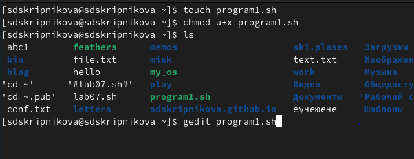{#fig:001 width=70%}

##

2. Написала текст программы 1 

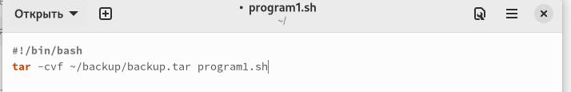{#fig:002 width=70%}

##

3. Проверила работу написанной программы 

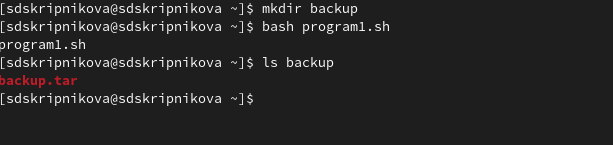{#fig:003 width=70%}

## Программа 2

4. Создала файл для программы 2 

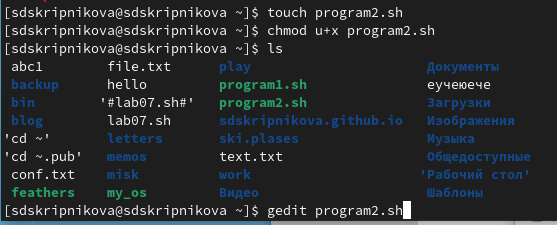{#fig:004 width=70%}

##

5. Написала текст программы 2 

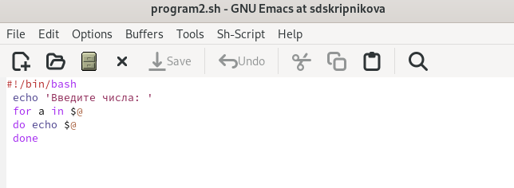{#fig:005 width=70%}

##

6. Проверила работу написанной программы 

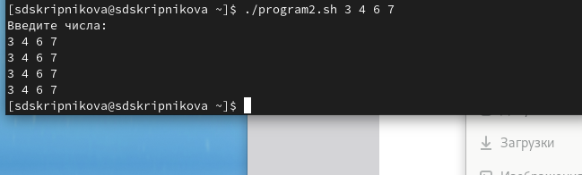{#fig:006 width=70%}

## Программа 3

7. Создала файл для программы 3 

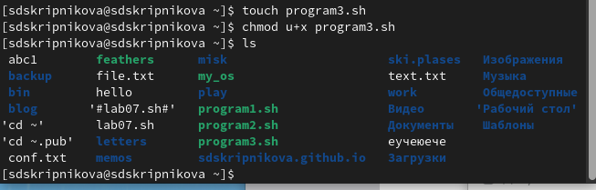{#fig:007 width=70%}

##

8. Написала текст программы 3 

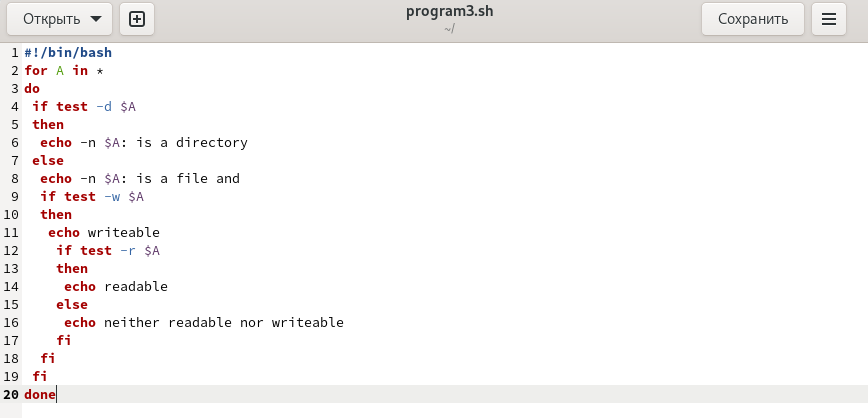{#fig:008 width=70%}

##

9. Проверила работу написанной программы 

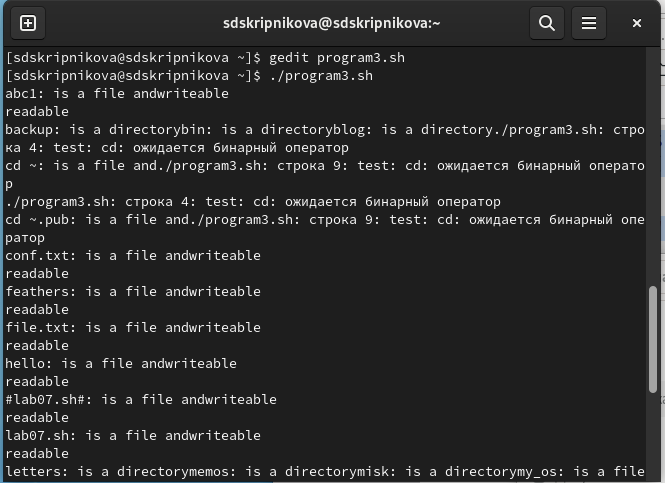{#fig:009 width=70%}

## Программа 4 

10. Создала файл для программы 4 

{#fig:010 width=70%}

##

11. Написала текст программы 4 

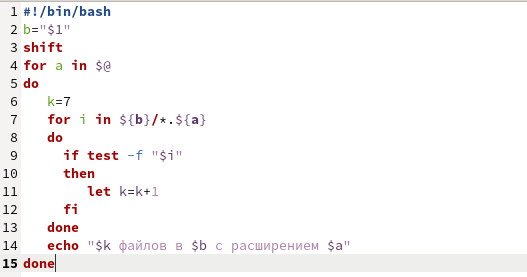{#fig:011 width=70%}

##

12. Проверила работу написанной программы 

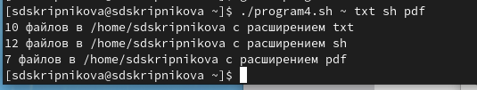{#fig:012 width=70%}

# Выводы

В процессе выполнения данной лабораторной работы я изучила основы программирования в оболочке ОС UNIX/Linux, научилась писать небольшие командные файлы

