---
## Front matter
lang: ru-RU
title: Презентация по лабораторной работе №11
subtitle: Операционные системы
author:
  - Cкрипникова София Дмитриевна
institute:
  - Российский университет дружбы народов, Москва, Россия
date: 22 апреля 2023

## i18n babel
babel-lang: russian
babel-otherlangs: english

## Formatting pdf
toc: false
toc-title: Содержание
slide_level: 2
aspectratio: 169
section-titles: true
theme: metropolis
header-includes:
 - \metroset{progressbar=frametitle,sectionpage=progressbar,numbering=fraction}
 - '\makeatletter'
 - '\beamer@ignorenonframefalse'
 - '\makeatother'
---

# Цель работы

Изучить основы программирования в оболочке ОС UNIX. Научится писать более сложные командные файлы с использованием логических управляющих конструкций и циклов.

# Выполнение лабораторной работы
## Программа 1
1. Создала файл для программы 1

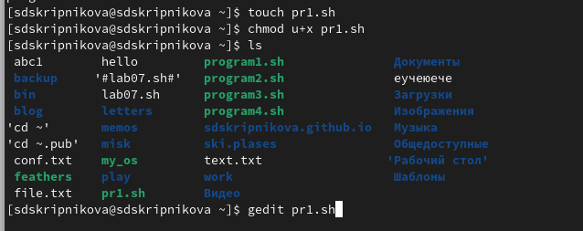{#fig:001 width=70%}

##

2. Написала текст программы 1 

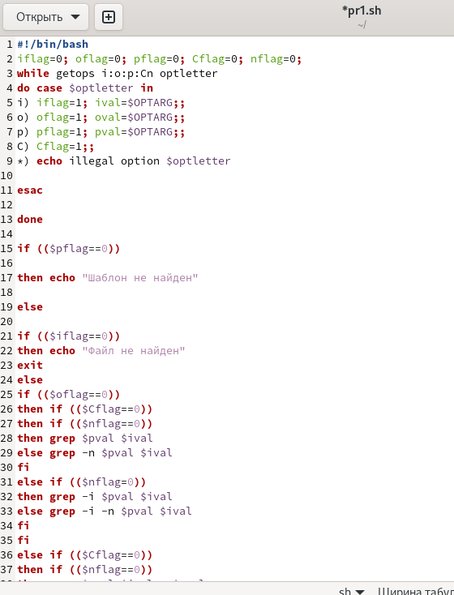{#fig:002 width=70%}

##

3. Проверила работу написанной программы 

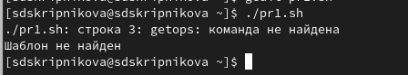{#fig:003 width=70%}

## Программа 2

4. Создала файл для программы 2 

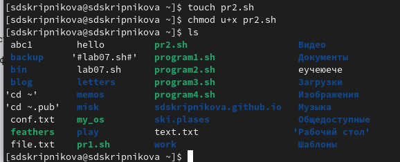{#fig:004 width=70%}

##

5. Написала текст программы 2 

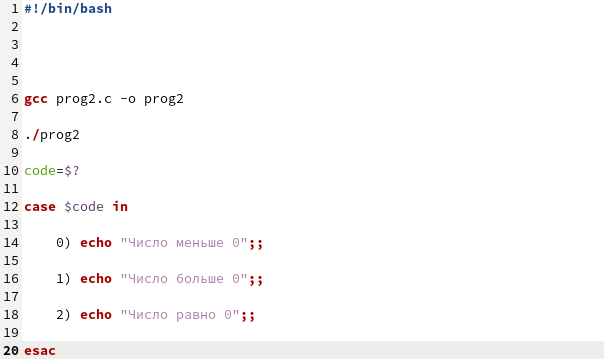{#fig:005 width=70%}

##

6. Проверила работу написанной программы 

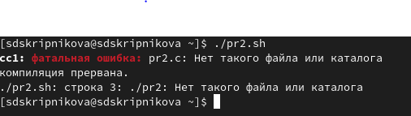{#fig:006 width=70%}

## Программа 3

7. Создала файл для программы 3 

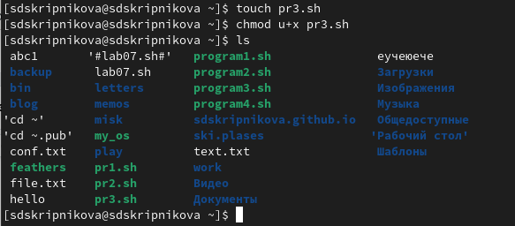{#fig:007 width=70%}

##

8. Написала текст программы 3 

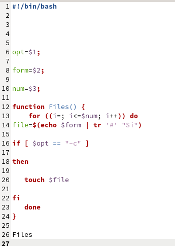{#fig:008 width=70%}

##

9. Проверила работу написанной программы 

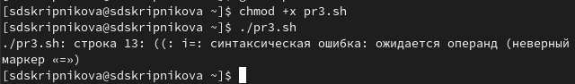{#fig:009 width=70%}

## Программа 4 

10. Создала файл для программы 4 

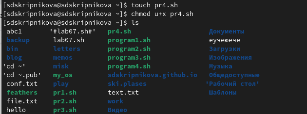{#fig:010 width=70%}

##

11. Написала текст программы 4 

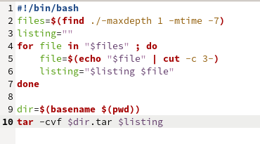{#fig:011 width=70%}

##

12. Проверила работу написанной программы 

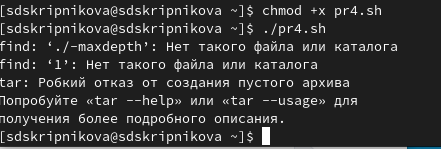{#fig:012 width=70%}

# Выводы

В ходе выполнения данной лабораторной работы я изучила основы программирования в оболочке ОС UNIX и научилась писать более сложные командные файлы с использованием логических управляющих конструкций и циклов.

