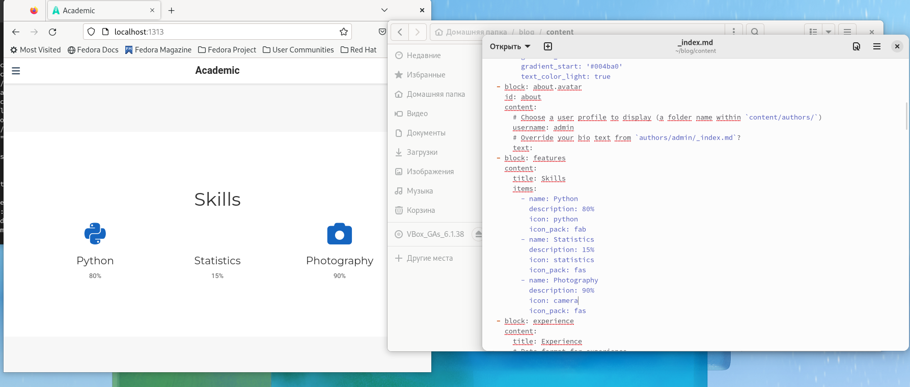
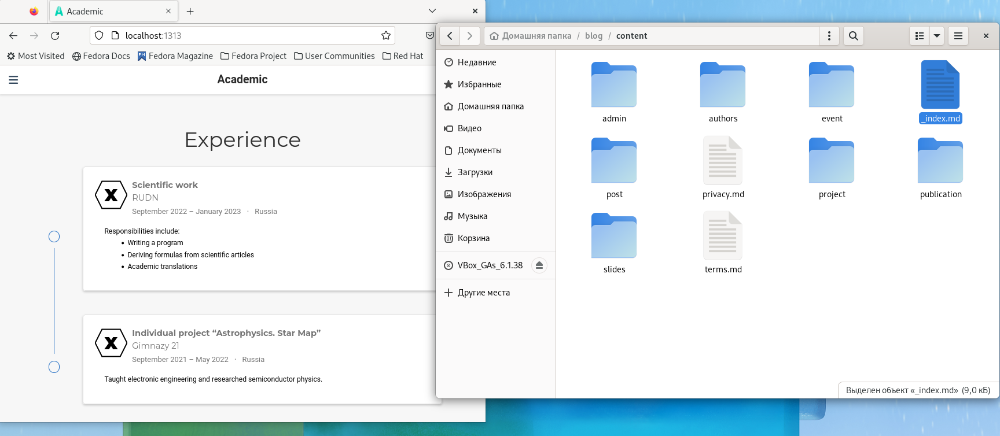
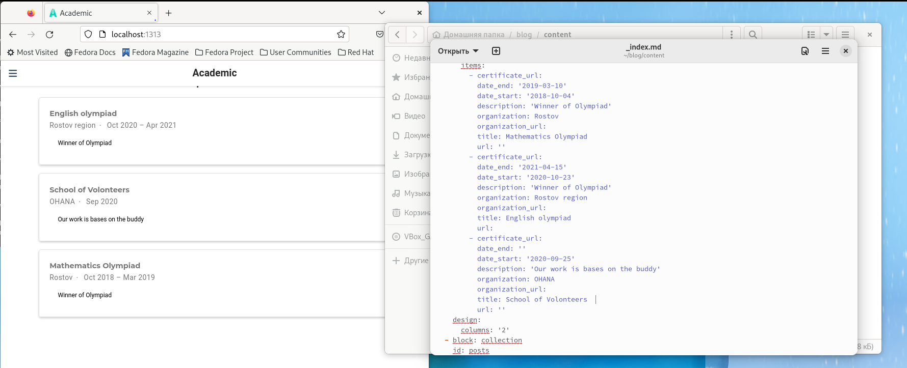
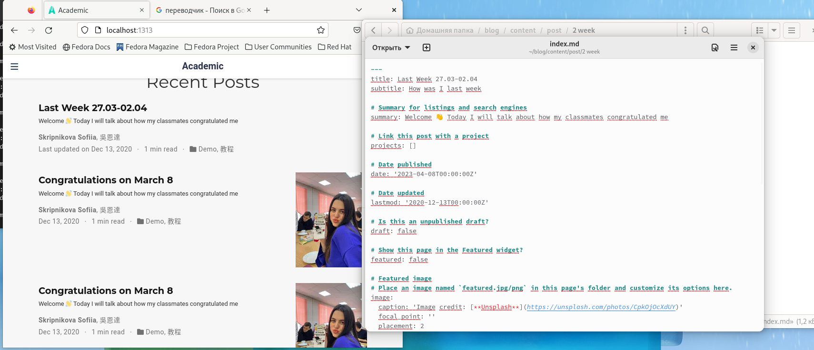
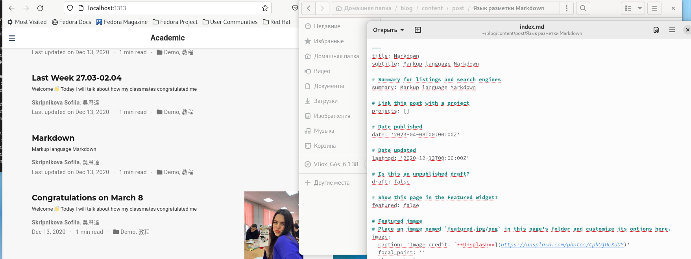
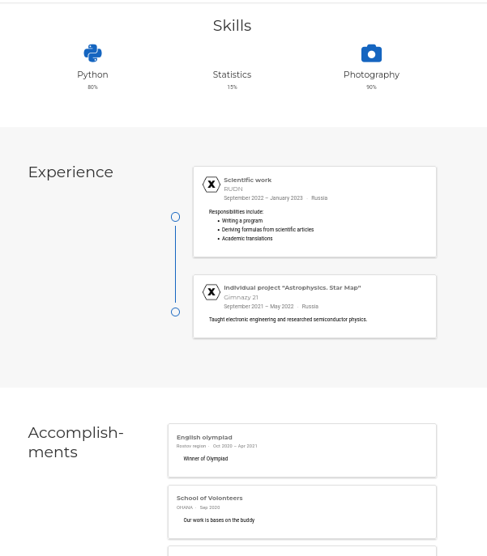

---
## Front matter
lang: ru-RU
title: Выполнение 3 этапа индивидуального проекта
subtitle: Операционные системы
author:
  - Скрипникова С.Д
institute:
  - Российский университет дружбы народов, Москва, Россия
date: 8 апреля 2023

## i18n babel
babel-lang: russian
babel-otherlangs: english

## Formatting pdf
toc: false
toc-title: Содержание
slide_level: 2
aspectratio: 169
section-titles: true
theme: metropolis
header-includes:
 - \metroset{progressbar=frametitle,sectionpage=progressbar,numbering=fraction}
 - '\makeatletter'
 - '\beamer@ignorenonframefalse'
 - '\makeatother'
---

# Информация

## Докладчик

:::::::::::::: {.columns align=center}
::: {.column width="70%"}

  * Скрипникова София Дмитриевна
  * студентка 1го курса
  * Российский университет дружбы народов

:::
::: {.column width="30%"}

:::
::::::::::::::

# Вводная часть

## Цель работы

Добавить к сайту достижения

# Этапы выполнения

## Выполнение лабораторной работы

- Добавить информацию о навыках (Skills).

##

- Добавить информацию об опыте (Experience).

##

- Добавила информацию о достижениях (Accomplishments). 

##

- Сделать пост по прошедшей неделе.

##

- Добавила пост на тему по выбору. Я выбрала "Язык разметки Markdown".

## 

- Сайт.

#Заключение 

## Выводы

В результате реализации третьего этапа индивидуального проекта я добавила на сайт достижения.

:::

