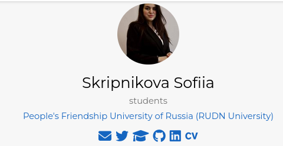
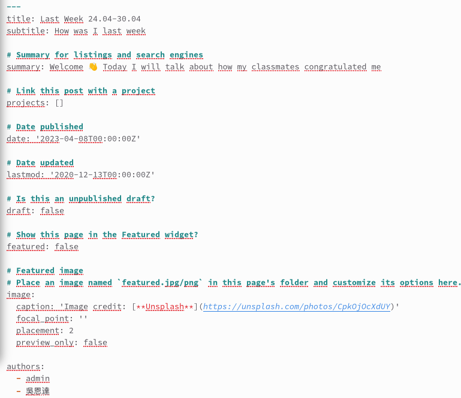
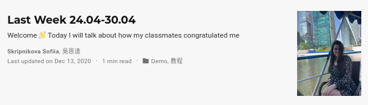
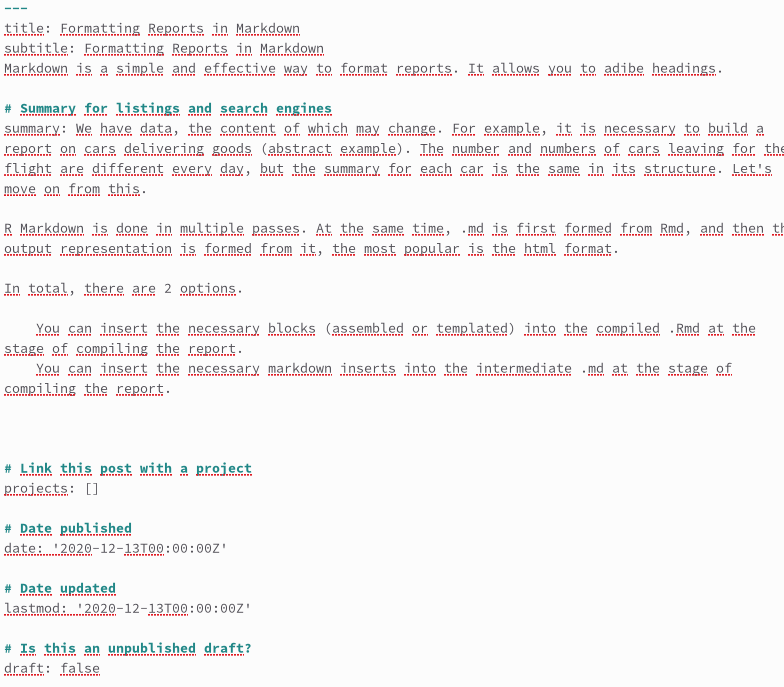

---
## Front matter
lang: ru-RU
title: Презентация по 4 этапу индивидуального проета
subtitle: Операционные системы
author:
  - Cкрипникова София Дмитриевна, НММбд-03-22
institute:
  - Российский университет дружбы народов, Москва, Россия
date: 29 апреля 2023

## i18n babel
babel-lang: russian
babel-otherlangs: english

## Formatting pdf
toc: false
toc-title: Содержание
slide_level: 2
aspectratio: 169
section-titles: true
theme: metropolis
header-includes:
 - \metroset{progressbar=frametitle,sectionpage=progressbar,numbering=fraction}
 - '\makeatletter'
 - '\beamer@ignorenonframefalse'
 - '\makeatother'
---

# Цель работы

Прикрепиь ссылки на свои страницы, выложить посты - выполнить задания 4 этапа индивидуального проекта. 
## Выполнение лабораторной работы

1. Зашли на страницу сайта с помощью команды hugo server 

2.  Добавила данные о себе: вдобавила ссыки на страницы.

{#fig:001 width=70%}

{#fig:002 width=70%}

##

3. Сделала пост по прошедшей неделе 

{#fig:003 width=70%}

{#fig:004 width=70%}

## 

4. Добавила пост на тему по выбору: Оформление отчета 

{#fig:005 width=70%}

{#fig:006 width=70%}

# Выводы

Я узнала ка менять информацию на сайте и смогла загрузить ссылки на свой страницы. Также научилась выкладывать посты на сайте.

